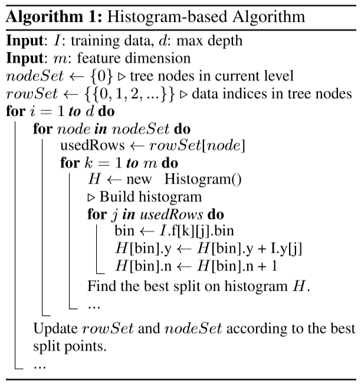
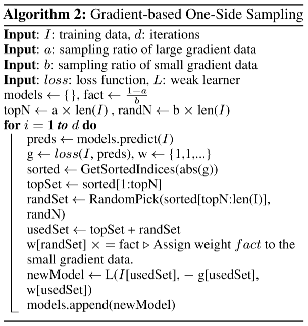
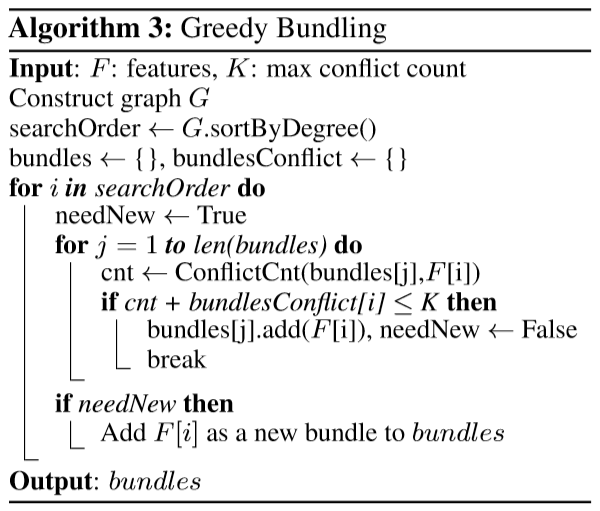
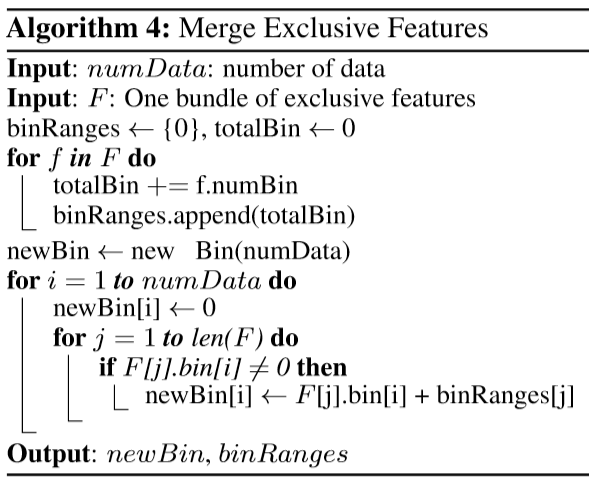
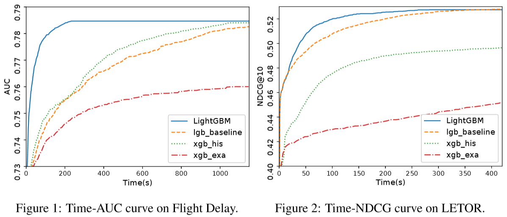

# LightGBM : A Highly Efficient Gradient Boosting Decision Tree

Guolin Ke, Qi Meng, Thomas Finley, Taifeng Wang, Wei Chen, Weidong Ma, Qiwei Ye, Tie-Yan Liu

 

### Abstract

**GBDT**
* a popular machine learning algorithm
* a few effective implementations such as XGBoost and pGBRT

 

**But**  
the efficiency and scalability are still unsatisfactory when the feature dimension is high and data size is large.

 

**To tackle this problem**,  
propose two novel techniques: *Gradient-based One-Side Sampling* (**GOSS**) and *Exclusive Feature Bundling* (**EFB**). 

 

**New GBDT implementation with GOSS and EFB LightGBM**  
speeds up the training process of conventional GBDT by up to over 20 times while achieving almost the same accuracy through experiments on multiple public datasets.

 

---

## 1. Introduction

**GBDT**
* a widely-used machine learning algorithm, due to its efficiency, accuracy, and interpretability
* state-of-the-art-performances in many machine learning tasks

 

**Need to**,  
for every feature, scan all the data instances to estimate the information gain of all the possible split points.  
(very time consuming when handling big data)

 

### Is it a good idea to reduce the number of data instances and features?

  .   .   .   

### ???

 

* While there is no native weight for data instance in GBDT, data instances with different gradients play different roles in the computation of information gain.
* Usually in real applications, although there are a large number of features, the feature space is quite sparse, which provides us a possibility of designing a nearly lossless approach to reduce the number of effective features.

 

### Two novel techniques towards this goal
* *Gradient-based One-Side Sampling* (**GOSS**)
* *Exclusive Feature Bundling* (**EFB**)

 

 

---

## 2. Preliminaries

### GBDT
  * an ensemble model of decision trees, which are trained in sequence
  * learn the decision trees by fitting the negative gradients in each iteration.
  * the main cost : learning the decision trees
  * the most time-consuming part in learning a decision tree is to find the best split points.
  
 
  
### Algorithmstofindsplit points
* **Pre-sorted Algorithm**
  * one of the most popular algorithms to find split points
  * enumerate all possible split points on the pre-sorted feature values
  * simple
  * can find the optimal split points
  * inefficient in both training speed and memory consumption
  
* **Histogram-based Algorithm**
  * the popular algorithms to find split points
  * Instead of finding the split points on the sorted feature values, bucket continuous feature values into discrete bins and uses these bins to construct feature histograms during training
  * more efficient in both memory consumption and training speed  
  * histogram building : O(#data × #feature)
  * split point finding : O(#bin × #feature)
  * since #bin is usually much smaller than #data, will be able to substantially speed up the training of GBDT if can reduce #data or #feature

 

---

## 3. Gradient-basedOne-SideSampling

### 3-1. AlgorithmDescription

**GOSS**
* keeps all the instances with large gradients and performs random sampling on the instances withsmallgradients. 
* In order to compensate the influence to the data distribution, when computingthe information gain, GOSS introduces a constant multiplier for the data instances with small gradients.

 

---

## 4. Exclusive Feature Bundling

 

---

## 5. Experiments

### 5-1. Overall Comparison

**Experimental environment**  
* a Linux server with two E5-2670 v3 CPUs (in total 24 cores) and 256GB memories
* All experiments run with multi-threading and the number of threads is fixed to 16.

 

**Use five different datasets which are all publicly available**  
Table 1 : Datasets used in the experiments

| Name | #data | #feature | Description | Task | Metric |
|------|:-----:|:--------:|-------------|------|--------|
| Allstate | 12M | 4228 | Sparse | Binary classification | AUC |
| Fight Delay | 10M | 700 | Sparse | Binary classification | AUC |
| LETOR | 2M | 136 | Dense | Ranking | NDCG |
| KDD10 | 19M | 29M | Sparse | Binary classification | AUC |
| KDD12 | 119M | 54M | Sparse | Binary classification | AUC |

 

**Overall training time cost comparison**  
Table2 : The values are the average time cost (seconds) for training one iteration

|  | xgb_exa | xgb_his | lgb_baseline | EFB_only | LightGBM |
|--|:-------:|:-------:|:------------:|:--------:|:--------:|
| Allstate | 10.85 | 2.63 | 6.07 | 0.71 | 0.28 |
| Fight Delay | 5.97 | 1.05 | 1.39 | 0.27 | 0.22 |
| LETOR | 5.55 | 0.63 | 0.49 | 0.46 | 0.31 |
| KDD10 | 108.27 | OOM | 39.85 | 6.33 | 2.85 |
| KDD12 | 191.99 | OOM | 168.26 | 20.23 | 12.67 |

 

**Overall accuracy comparison on test datasets.**  
Table3 : Use AUC for classification task and NDCG@10 for ranking task.

|  | xgb_exa | xgb_his | lgb_baseline | EFB_only | LightGBM |
|--|:-------:|:-------:|:------------:|:--------:|:--------:|
| Allstate | 0.6070 | 0.6089 | 0.6093 | 0.6064±7e-4 | 0.6093±9e-5 |
| Fight Delay | 0.7601 | 0.7840 | 0.7847 | 0.7780±8e-4 | 0.7846±4e-5 | 
| LETOR | 0.4977 | 0.4982 | 0.5277 | 0.5239±6e-4 | 0.5275±5e-4 | 
| KDD10 | 0.7796 | OOM | 0.78735 | 0.7759±3e-4 | 0.78732±1e-4 |
| KDD12 | 0.7029 | OOM | 0.7049 | 0.6989±8e-4 | 0.7051±5e-5 |

 

LightGBM is the fastest while maintaining almost the same accuracy as baselines.  
Since xgb_his is quite memory consuming, it cannot run successfully on KDD10 and KDD12 datasets due to out-of-memory.  
The speed-up is calculated based on training time per iteration since allalgorithmsconvergeaftersimilarnumberofiterations.  

 

**Accuracy comparison on LETOR dataset for GOSS and SGB under different sampling ratios**  
Table4 : 

| Sampling ratio | 0.1 | 0.15 | 0.2 | 0.25 | 0.3 | 0.35 | 0.4 |
|:--------------:|:---:|:----:|:---:|:----:|:---:|:----:|:---:|
| SGB | 0.5182 | 0.5216 | 0.5239 | 0.5249 | 0.5252 | 0.5263 | 0.5267 | 
| GOSS | 0.5224 | 0.5256 | 0.5275 | 0.5284 | 0.5289 | 0.5293 | 0.5296 |

 

### 5-2. Analysis on GOSS

* The speed-up ability of GOSS
  * 
  
  

---

## 6. Conclusion

A novel GBDT algorithm called **LightGBM** contains two novel techniques: ***Gradient-based One-Side Sampling*** and ***Exclusive Feature Bundling*** to deal with large number of data instances and large number of features respectively.  
Show that with the help of **GOSS** and **EFB** ,LightGBM can significantly outperform XGBoost and SGB in terms of computational speed and memory consumption.  

