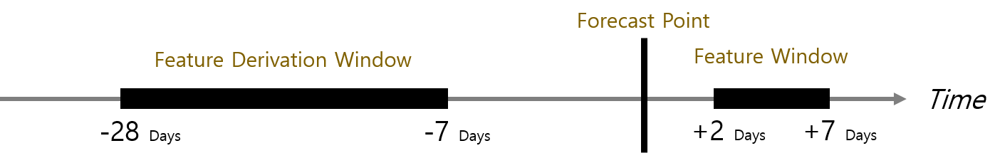

# Time Series

 

Time series problems are **intrinsically dynamic and moving**. 
This amplifies the sensitivity to overfitting and can also make it challenging for some models to find predictive signals to begin with.

 

Most advanced machine learning algorithms (e.g., XGBoost) are **not time-aware**. 
They typically look at one row at a time when forming predictions. 
In order to use these methods for forecasting, we need to derive informative features, based on **past and present data in time**.

 

---

### Time Series Framework

 

- Forecast Point := an arbitrary point in time that a prediction is being made.

- Feature Derivation Window (FDW) := a rolling window, relative to the Forecast Point, which can be used to derive descriptive features.

- Forecast Window (FW) := the range of future values we wish to predict, called Forecast Distances (FDs).

 

 

- How much recent history is required in order to make new predictions (e.g., at least 28 days ago)

- How recent of data is availale (e.g., up to 7 days ago)

- Which forecast distances are needed (2 to 7 days)

 

---

### Time Series Features

 

1. Date Time Features : These are components of the time step itself for each observation.   
ex) Month, Day, ...  

2. Lag Features : These are values at prior time steps.   
ex) Value(t-1), Value(t+1), ...  

3. Window Features : These are a summary of values over a fixed window of prior time steps.   
ex) Rolling mean, max, min,... (statistics)  
ex) Rolling entropy, majority for categorical features  
ex) Rolling text statistics for text features  
ex) Bollinger bands and statistics

 

--

### Time series Treatments

 

Can consider ways to transform the target variable in order ro maximize the predictive accuracy and stability of predictions.

---

### References

https://www.kdnuggets.com/2017/11/automated-feature-engineering-time-series-data.html

https://machinelearningmastery.com/basic-feature-engineering-time-series-data-python/

