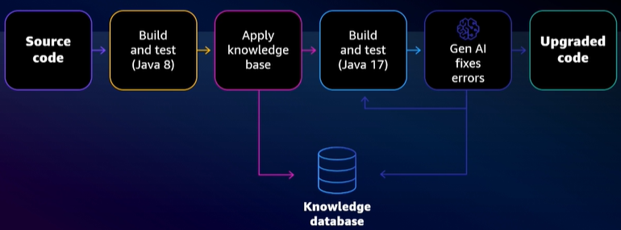
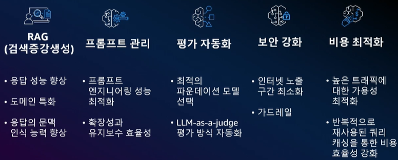
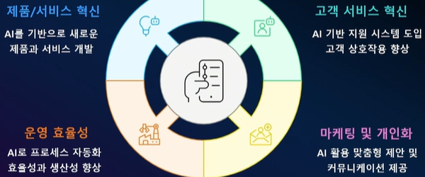
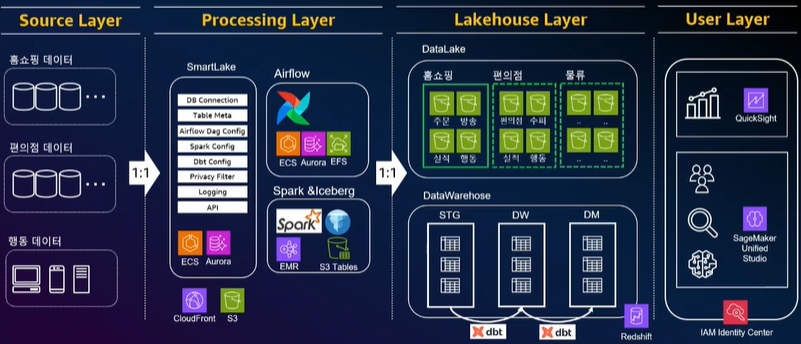
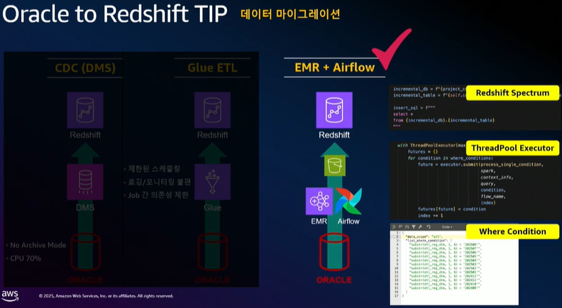
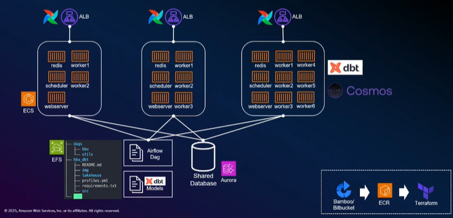
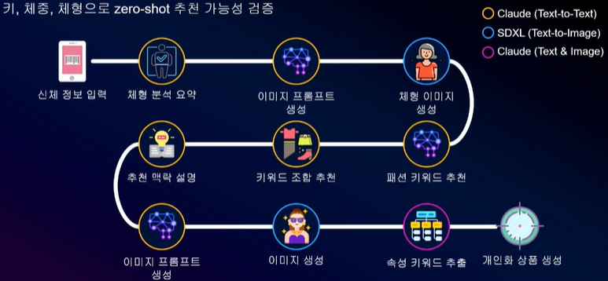

# AWS Summit Seoul 2025

❗일부 내용은 정확히 듣지 못했거나 놓친 부분이 있음
- 기간 : 5월 14일 (수) - 5월 15일 (목)
- [온디맨드 등록](https://aws.amazon.com/ko/events/summits/seoul/agenda/?utm_source=chatgpt.com&aws-summit-korea.sort-by=item.additionalFields.ranking&aws-summit-korea.sort-order=asc&awsf.aws-summit-seoul-level=*all&awsf.aws-summit-seoul-seoul-day1-session=*all&awsf.aws-summit-seoul-seoul-day2-session=*all&awsf.aws-summit-seoul-topic=*all)
    - 공개 기간 : 6월 2일 (월) 오전 9시 - 8월 12일 (금) 오후 6시
- 목차
    - Day 1 (5/14)
        - 기조연설
        - [여행 및 숙박] 여행 goes AI! AWS 생성형 AI 없이는 살아남을 수 없어!
        - [리테일 및 소비재] 생성형 AI 기반 쿠팡 광고의 고객을 위한 혁신
        - [생성형 AI] 기업을 위한 생성형 AI 도입, 메가존 클라우드와 함께한 성공적 터닝 포인트
        - [소프트웨어 및 인터넷] 생성형 AI와 디자인의 만남: Amazon Bedrock과 Claude 3.5로 혁신한 미리캔버스
        - [생성형 AI] 초거대 영상 이해 모델 스타트업 트웰브랩스의 AI 인프라 고도화 여정
        - [기술 트랜드] 계산과학의 혁명적 전환점: 양자 컴퓨팅 기술과 Amazon Braket이 여는 미래
    - Day 2 (5/15)
        - 기조연설
        - [데이터베이스] 서버리스 분산 SQL DB: Amazon Aurora DSQL의 아키텍처 알아보기
        - [개발자 역량강화] Amazon Q Developer 애플리케이션 현대화의 신(神)
        - [데이터 분석 현대화] Exadata에서 Redshift로: 클라우드 마이그레이션 여정
        - [AWS 커뮤니티] 생성형 AI 기반 리뷰 검수 자동화 및 맞춤형 체형 상품 추천

---

 

## Day 1 (5/14)

### 기조연설
- `Apache Iceberg` : S3 기반의 대용량 트랜잭션 데이터 처리를 안정적이고 효율적으로 지원함
- `Amazon SageMaker` : AI 프로젝트에 필요한 전 과정을 통합 관리할 수 있어 리소스 운영이 용이함

 

**현대카드**
- 방대한 카드 데이터는 단순한 거래정보를 넘어 개인의 라이프스타일을 반영하는 데이터임
- 어디에 거주하고, 어떤 직장에 다니며, 어떤 곳을 여행하는지 등 다양한 생활 패턴이 담겨 있음
- 이러한 데이터를 기반으로 이탈 가능성, 자동차 구매, 백화점 방문 등 고객 행동을 예측하는 다양한 과제가 생겨남
- 고객이 생성하는 위치, 소비, 라이프스타일 등 예측 가능한 데이터를 활용해 미션을 수행해야 하는 환경이 됨
- 이를 위해 데이터와 AI가 통합된 자체 플랫폼 [UNIVERSE]를 구축함
- [UNIVERSE]는 AWS 서비스를 활용해 빠르게 개발할 수 있었음
- 개발된 플랫폼은 일본 2위 카드사 SMCC에 판매함
- 이 같은 사례를 바탕으로 글로벌 시장으로의 확장을 계획 중임
- AWS를 활용함으로써 코드 하나로 다양한 리전에 플랫폼을 셋업할 수 있었음
- AWS의 기술 수준을 자체적으로 따라잡는 건 쉽지 않음
- 따라서 앞으로도 AWS에 이미 있는 기능들을 적극적으로 활용해 플랫폼을 발전시켜 나갈 예정임

 

- `Amazon Nova Foundation Models` : 다양한 업무에 맞는 최적의 모델을 선택할 수 있어, 모델 선택에 대한 고민을 덜어줌
- `Amazon Bedrock` : 보안, 환각(Hallucination) 등 LLM 활용 시 발생할 수 있는 주요 문제들을 효과적으로 완화하고 관리할 수 있음

 

**트웰브랩스**
- 영상을 텍스트처럼 이해하고 검색할 수 있도록 하는 멀티모달 AI 기술을 연구함
- 방대한 영상 데이터가 폭발적으로 증가하고 있음
- 사람들은 영상으로 이야기를 공유하고 소통하지만, 그 영상이 가지고 있는 정보는 실제로 잘 활용되지 못하고 있음
- 영상은 전체를 분석하려면 시간과 비용이 많이 들기 때문에 쉽게 활용되기 어려운 데이터임
- 특히 영상 속 맥락, 흐름, 음악, 대사, 목소리 등 다양한 요소를 통합적으로 이해하는 것이 어려움
- 이 모든 요소를 하나의 텍스트처럼 다루어 영상 전체의 의미와 맥락을 AI가 이해할 수 있도록 모델링하고 있음
- 이를 통해 스포츠 하이라이트 추출과 같은 콘텐츠 클립 생성 작업을 빠르고 효율적으로 자동화할 수 있음
- 학습 과정에서는 `Amazon SageMaker`를 활용하여, 모델 학습 중 발생하는 오류나 중단 상황에서도 자동으로 이어서 학습할 수 있도록 안정성을 확보함
- 현재는 `Amazon Bedrock`과 함께 온보딩 중이며, 다양한 LLM 및 멀티모달 모델을 통합적으로 활용하기 위한 준비를 하고 있음

 

- `Amazon Q Developer` : 개발자의 생산성을 높이고 반복 업무를 줄이기 위한 생성형 AI 기반 도구임
    - 코드 생성, 테스트 코드 작성, 문서 요약, 코드 리팩토링 등을 자동화할 수 있음
    - 쿠팡 사례 : 대규모 마이그레이션 작업을 개발자 5명, 3개월 만에 완료함

 

### [여행 및 숙박] 여행 goes AI! AWS 생성형 AI 없이는 살아남을 수 없어! 

- 상황에 알맞은 올바른 Tool 선택
    - `Amazon Bedrock`을 통해 다양한 생성형 AI 모델을 상황에 맞게 선택할 수 있음
    - TUI(독일) 사례: Llama 모델은 음성 톤 학습에, Claude 모델은 가이드라인 적용에 활용하여 콘텐츠 작성 효율성 및 품질 향상을 달성함
- 강력한 데이터 기반 필요
    - 생성형 AI에만 초점을 맞추는 것은 빙산의 일각에 불과하며, 견고한 데이터 기반이 필수적임
    - Booking.com은 대규모 데이터를 효율적으로 처리하여 서비스 혁신을 이룸
    - Lonely Planet은 책, 여행자 평가 등의 데이터를 LLM에 통합하여 개인화된 여행 콘텐츠(관심 영역, 경험, 여행 일정)를 제공함

 

- 현재 여행 업계는 데이터 품질 문제로 인해 생성형 AI의 활용도가 낮고, 실질적인 성과 도출이 어려움
    - 데이터가 분산되어 있기 때문임
    - 또한, 조직에서 생성형 AI를 어떻게 활용할 지에 대한 사용 사례가 명확하지 않음
    - LATAM 항공 사례: 서비스 장애에 대한 고객 서비스 영역에서 자동화는 25%로 제한적이었음
        - 간단한 질문에 대해서도 국가별로 다양한 지식을 가지고 있어야 함
        - AWS와 함께 국가별 다양한 지식을 갖춘 AI 에이전트 개발을 통해 고객 응대 효율성 향상을 위해 노력함
- 애플리케이션 간 데이터가 분리되어 있어 생성형 AI를 통한 업무 자동화가 어려움
    - 다양한 툴을 사용하여 서로 다른 정보를 취합하여 사용하고 있으나, 취합된 정보를 통합하여 정보를 제공하는 툴은 부족함
    - 분산된 데이터, 데이터의 확산, 인사이트 실행 가능성에 대한 개선이 필요함
    - 이러한 문제를 해결하기 위해 기업 내부 데이터를 활용하는 데 강력한 생성형 AI 서비스인 `Amazon Q Business`를 런칭함
- 기존 레거시 기술로 인해 생성형 AI 프로젝트가 지연되고 있으며, 기술 인재 확보는 어려움 (특히, 유능한 개발자가 호텔 산업을 선호하지 않음)
    - 또한, 개발자는 업무 시간 중 30%만 생산성 있는 업무(서비스 기능 개발 등)를 함
        - 70%는 유지보수, 문서작업 등에 집중되어 있음
    - 이러한 개발자 확보의 어려움과 생산성 향상을 해결하기 위해 `Amazon Q Developer`를 개발함
    - 유나이티드 에어라인 사례: 장기간 방치된 자바 버전을 업그레이드하기 위한 마이그레이션 작업을 5명의 개발자가 평균 10분가량 소요하여 2일 만에 완료함
        - 방대한 규모(약 1,000개의 어플리케이션)의 마이그레이션 작업을 `Code Tansformer` 기능을 사용하여 해결함
        

 

### [리테일 및 소비재] 생성형 AI 기반 쿠팡 광고의 고객을 위한 혁신

- 엔터프라이즈 환경을 위한 생성형 AI 최적화
    - RAG, 프롬프트 관리, 평가 자동화, 보안 강화, 비용 최적화를 `Amazon Bedrock`을 활용하여 간단하게 해결 가능함
    
    - `Bedrock Knowledge Bases` 기능을 통해 지식 저장소를 구축하고, 다양한 데이터를 저장하거나 벡터 검색을 수행할 수 있음
    - `Bedrock Prompt Management`를 통해 프롬프트를 체계적으로 관리할 수 있음
    - `Bedrock Model Evaluation` 기능을 통해 최적의 파운데이션 모델을 비교 및 선택하고, RAG 워크플로우를 평가할 수 있음
    - `Bedrock Flows`를 활용해 생성형 AI 개발 워크플로우를 시각화하고, 평가 과정를 자동화함
    - `Bedrock Guardrails`를 활용하여 민감 정보를 사전에 필터링함
    - `Cross-region Inference`을 통해 여러 리전 간 자동 추론 라우팅이 가능하여 급격한 트래픽 관리가 가능함

 

**쿠팡 광고**
- 쿠팡은 높은 수준의 데이터 품질과 AI 기술력을 보유하고 있음
    - ML을 활용한 자동화된 캠페인 운영 환경을 구축함
    - end-to-end 데이터 추적 및 관리 체계를 갖추고 있음
- 대부분의 광고주(소상공인 등)가 비전문가이므로, 쉽고 간단한 사용성을 제공하도록 광고 솔루션을 설계함
    - 수동 입찰(Manual bidding)은 키워드, 비딩 단가 등 광고 캠페인 세팅값이 많아 어려움
    - 쿠팡은 자동 입찰(Auto bidding) 방식으로, 목표 ROAS 정보로 쉽고 간단하게 사용할 수 있음
- 마케터들이 빠르게 변하는 쇼핑 트렌드를 실시간으로 파악하기 어려움
    - 쿠팡은 ML을 활용하여 트렌드 변화를 신속하게 포착하고 자동화된 광고 운영을 지원함
    - 하지만, 광고 솔루션이 다양화되고 고도화됨에 따라 사용의 복잡성이 증가함
    - '누구나 쉽게 사용할 수 있어야 한다'는 원칙과 반대되어 생성형 AI를 도입하여 이 문제를 해결함
- 기존에는 전화로 광고 컨설팅을 제공하였음
    - `Amazon Bedrock`을 활용하여 타이트한 프롬프트 엔지니어링을 통해 생성형 AI 기반 보고서 자동화하여 고도화함
    - 환각 현상을 보완하기 위해 수치 기반 검증 기법을 도입함
    - `Bedrock Flows`를 통해 메뉴얼로 받은 피드백을 쉽게 반영하고 프롬프트 관리를 효율화함
- `Amazon Bedrock` 호출을 줄이기 위해 프롬프트 캐싱을 활용함
- 비용 문제를 해결하고 서비스 API 쿼터(quota) 확보를 위해 `Cross-region Inference`을 적용함

 

### [생성형 AI] 기업을 위한 생성형 AI 도입, 메가존 클라우드와 함께한 성공적 터닝 포인트

**AI 시대의 기업 과제**

 

### [소프트웨어 및 인터넷] 생성형 AI와 디자인의 만남: Amazon Bedrock과 Claude 3.5로 혁신한 미리캔버스

**`Amazon Bedrock` 기반 최적화 전략**
- 정확도 최적화
    - 프롬프트 품질 개선을 위해 few-shot, chain-of-thought(CoT), prompt chaining 등을 적용함
        - 이러한 프롬프트 전략을 쉽고 체계적으로 관리할 수 있도록 `Bedrock Prompt Management` 기능을 지원함
    - RAG 방식은 `Bedrock Knowledge Bases` 기능을 통해 다양한 외부 데이터 저장소와 연동해 구현 가능함
    - 파인튜닝 또는 지속적인 사전 학습을 한 경우 `Bedrock Custom Model Import` 기능을 활용해 손쉽게 모델을 가져와 사용 가능함
- 처리량 최적화
    - 다량의 추론이 필요한 경우 `Bedrock Batch Inference` 기능으로 처리 효율성 확보 가능함
    - 단일 리전의 용량 한계에 묶이지 않고 `Cross-Region Inference` 기능을 통해 자동 분산 처리 가능함
- 지연 시간 최적화
    - `Latency Optimized Inference`를 통해 빠른 응답 속도를 제공함
    - 자주 사용하는 프롬프트는 `Bedrock Prompt Caching` 기능으로 반복 호출 비용과 시간을 절감 가능함
- 비용 최적화
    - 모델 경량화를 위한 `Bedrock Model Distillation` 기능 적용 가능함
    - `Bedrock Intelligent Prompt Routing` 기능으로 비용 최적화 가능함

 

**미리디 디자인 플랫폼**
- 미리캔버스는 Claude 3.5를 주요 생성형 AI 모델로 사용함
    - 자연어 이해와 문맥 처리 능력이 우수해, 프레젠테이션 자동 생성 작업에 적합했음
- 시스템 구조는 ***<u>Spring</u>*** 과 `Amazon Bedrock`을 연동해, ***<u>LangGraph</u>*** 기반 워크플로우까지 구성하여 사용함
- 프레젠테이션 제작 과정은 목차 생성 → 페이지 선택 → 내용 생성 단계로, 이를 자동화함
- Hallucination을 줄이기 위해 인터넷 검색을 구현함
    - ***<u>Claude</u>*** 가 학습하지 않은 콘텐츠가 필요한 경우, Hallucination이 발생되는 것을 발견함
    - Google 검색, 나무위키, 네이버 블로그 검색을 통해 정보를 보강함
- 이미지는 미리캔버스의 고품질 이미지를 (벡터) 검색하여 사용함 (`Amazon SageMaker`, `Amazon OpenSearch Service` 사용)
    - AI 이미지는 부자연스러우며, 이미지 생성 비용도 절약할 수 있기 때문임 

 

### [생성형 AI] 초거대 영상 이해 모델 스타트업 트웰브랩스의 AI 인프라 고도화 여정

- `SageMaker HyperPod`
    - 여러 대의 GPU를 사용하므로 비용이나 운영 부담을 최소화할 수 있음
    - GPU 인스턴스 장애 발생 시에도 다음 작업이 중단되지 않고 연속적으로 이어지도록 설계됨

 

**트웰브랩스 영상 이해 모델 개발**
- [Marengo]는 영상 검색 모델임 
- [Pegasus]는 영상 언어 생성 모델로, 영상 내용 요약, 질의응답, 하이라이트 장면 추출 등을 수행함
- `Amazon SageMaker HyperPod`을 활용하여 학습과 추론 리소스를 통합관리함으로써, GPU를 가변적으로 사용함
    - GPU 자원을 학습(또는 추론)에 더 사용할지 용도에 따라 유연하게 분배하여 사용할 수 있음
- [Marengo]는 벡터 기반 검색을 위해 `Amazon Aurora PostgreSQL`과 ***<u>pgvector</u>*** 를 사용함
    - 데이터 정합성을 위해 벡터 기반 데이터베이스가 아닌 RDS에서 모든 데이터를 통합하여 사용함
- [Pegasus]는 데이터 검색 작업의 빈도가 낮다고 판단하여 비용 효율성을 위해 `Amazon S3 Object Storage`에 데이터를 저장함
- AI 인프라 비용 최적화
    - `Amazon EKS Cluster`에서 ***<u>Karpenter</u>*** 를 사용하여 자동으로 노드를 프로비저닝함
    - Spot과 On-Demand 인스턴스의 비율을 조정함
    - 인기 있는 인스턴스 확보를 위해 멀티 리전 옵션을 고려함
    - ***<u>KEDA</u>*** (Kubernetes-based Event Driven Autoscaler)를 사용하였으며, minReplicas를 0으로 설정함

 

### [기술 트랜드] 계산과학의 혁명적 전환점: 양자 컴퓨팅 기술과 Amazon Braket이 여는 미래

- 큐비트(Qubit)는 기존 컴퓨터의 비트와 달리, 동시에 여러 상태를 가질 수 있는 양자 정보 단위임
- 양자 컴퓨팅의 핵심은 오류 없이 동작하는 안정적인 큐비트를 만드는 것임
- 현재 기술 수준에서는 약 1,000번의 양자 연산 중 1번꼴로 오류가 발생함
- 고전 컴퓨터에서는 약 10¹⁸번 연산에 1번 정도 오류가 발생함
- `Amazon Braket`은 다양한 양자 하드웨어와 시뮬레이터를 제공하는 AWS의 양자 컴퓨팅 서비스로,
연구자와 개발자가 실험적으로 양자 알고리즘을 개발하고 테스트할 수 있도록 지원함

---

 

## Day 2 (5/15)

### 기조연설

- 복잡성을 작은 조각으로 나누세요
    - `Amazon CloudWatch`를 활용하여 시스템을 모니터링하고, 복잡한 구조를 세분화하여 관리 가능함
- 셀 단위로 영향 범위를 최소화하세요
    - `Amazon CloudFront`, `Amazon Route 53`을 이용한 셀 기반 아키텍처를 통해 장애 발생 시 영향을 최소화할 수 있음
- 가능한 모든 것을 자동화하세요

 

**삼성전자 MX사업부**
- 당면 과제 : 거버넌스 확립-과제별 사일로(Silo) 최소화, 레거시 운영 개선-안정성 및 보안성 강화, 클라우드 자원 관리체계 확립-효율적인 비용 사용
- 기술 측면, 조직 및 문화 측면(FinOps 체계 구축)을 핵심으로 과제를 해결함
- 클라우드 운영 고도화와 Hybrid Cloud 운영체계 확립을 통해 가능한 모든 것을 자동화하고자 함
- 휴먼 에러 최소화하여 클라우드 서비스를 강화하고자 함

 

**T map mobility**
- 전략 : 신규 서비스-AWS 우선 활용, 기존 서비스-단계적 마이그레이션 진행
- 주요 데이터베이스
    - `Amazon Aurora` : 사용자 프로필 관리
    - `Amazon Aurora PostgreSQL` : 인증/회원 정보 관리
    - `Amazon DynamoDB`: 운행 이력 저장
    - `Amazon OpenSearch` : 로그 분석
- 클라우드 서비스 기반으로 빠른 실험과 배포를 통해 성과를 이루어냄
    - 매출 규모 증가, 트래픽 및 사용자 증가, 인프라 규모 및 비용 감소
- AI 플랫폼으로 진화하여 사업 영역을 확대하고자 함
    - 자연어 처리 기술을 통한 검색 경험 강화
    - LLM 기반 음성 인식 및 모빌리티 에이전트 기능 도입

 

- `Amazon Bedrock` : 다양한 모델을 목적에 맞게 사용할 수 있는 도구임
    - `Amazon Bedrock Guardrails` : 민감 정보(개인정보, 브랜드 정보 등)가 AI에 입력되는 것을 제어함
- `Amazon Q` : Agent AI 도구로, 다양한 업무를 자동화하고 지원함

 

**포자랩스**
- 저작권 걱정 없는 음원을 생성할 수 있는 서비스 제공함
- AWS Summit 오프닝 음원을 포자랩스가 생성함

 

### [데이터베이스] 서버리스 분산 SQL DB: Amazon Aurora DSQL의 아키텍처 알아보기

- `Amazon Aurora DSQL`
    - 서버리스 분산 SQL 데이터베이스로, 트랜잭션 워크로드에 최적화되어 있음
    - 분석 관련 워크로드에는 적합하지 않음
    - 서버리스 아키텍처로 인프라 관리 부담이 없음
    - Active-Active 멀티리전 구성을 지원하여 고가용성을 제공함
        - 쓰기 관련 확장성 구현이 어려운 과제지만, 쓰기 트래픽에 대한 확장성도 지원함
    - PostgreSQL과 호환되어 기존 도구(드라이버) 및 코드와의 통합이 용이함
- 트랜잭션 데이터베이스
    - 아주 정밀한 시간 정보를 사용함
    - ACID 속성을 완전하게 지원하여 데이터 일관성을 보장함
        -  Atomic, Consistent, Isolated, Durable 등 DB가 갖추어야 할 것이 내장되어 있음
    - Journal, Adjudicator, Storage, Query processor, Transaction and session router로 비교적 간단한 구현으로 안정적으로 DB가 운영됨
    - 로그 기반으로 트랜잭션 시점을 식별하고, 해당 시점의 일관된 데이터를 조회하는 방식임
- Isolation (격리)
    - 아주 정밀한 시간 정보를 사용함
    - 낙관적 동시성 제어(Optimistic Concurrency Control)를 적용하여, 커밋 이전에는 락을 포함한 어떠한 coordination도 필요 없음
        - 분산 데이터베이스 기반으로 만들어졌기 때문에 동시에 많은 트랜잭션이 처리되어야 하므로 가장 중요한 최적화 포인트임
        - 여러 트랜잭션이 동시에 접근하더라도 각각의 트랜잭션이 독립적으로 실행하고 커밋 시점에서만 충돌 여부를 검사하고 최종 확정함
    - Strong Snapshot Isolation을 제공하여, PostgreSQL의 Repeatable Read 수준과 동일한 격리 수준을 유지함
        - 커밋되지 않은 데이터는 절대 노출되지 않으며, 읽기 작업은 반복 가능함
        - 모든 읽기는 논리적 시간의 한 시점에서 이루어짐
        - 쓰기 충돌 시 해당 트랜잭션은 거부됨
- Cross-region
    - 리전 간 물리적 거리로 인해 네트워크 왕복 시간(RTT, Round-Trip Time)에 차이가 발생함
    - 이를 고려해, 커밋 시점에 단 한 번만 coordination이 이뤄지도록 설계됨
    - read-only 트랜잭션은 coordination이 전혀 필요 없어 지연 시간의 영향을 받지 않음
    - 장애 상황에서도 빠른 전환이 가능하도록 고가용성을 위한 최적화가 적용됨
- 현재 프리뷰 상태로 제공되며, 정식 출시 전 사용자 피드백을 받고 있음

 

### [개발자 역량강화] Amazon Q Developer 애플리케이션 현대화의 신(神)

- `Amazon Q Developer`
    - 레거시 애플리케이션의 현대화가 필요함
    - 기존 방식은 복잡하고 전문 기술이 필요하며, 혁신 속도를 지연시킴
    - 생성형 AI 기반 기능을 통해 코드 검색, 분석, 관리 등을 자동화함
    - 도메인 전문성을 갖춘 AI 에이전트가 개발자 업무를 보조함
    - `Transformation` 기능을 통해 코드 리팩토링 및 마이그레이션 자동화가 가능함
- 메인프레임의 Java 전환
    - 오래된 기업에서 사용하는 메인프레임 시스템의 현대화가 중요함
    - 복잡한 구조로 인해 막대한 리소스와 시간이 소요됨
    - `Amazon Q Developer`는 코드 분석 → 문서 생성 → 코드 분해 → 마이그레이션 순서 계획 → 코드 리팩토링 등의 워크플로우를 전체적으로 자동화함
    - 분석된 코드를 바탕으로 항상 최신 상태의 문서를 자동 생성함
    - 수년이 걸릴 수도 있는 작업을 단축할 수 있으며, 관리 UI를 통해 실행 계획을 확인 가능함
- VMware to AWS 마이그레이션
    - 마이그레이션 과정의 워크플로우는 데이터 수집 → 애플리케이션 그룹화 & 단계별 계획 수립 → 네트워크 변환 & 배포 (중요한 단계) → 마이그레이션 통합 관리임
    - 전체 프로세스는 대시보드 기반 모니터링을 통해 실시간으로 추적 가능함
- .NET 크로스 플랫폼 전환
    - 비용 절감, 혁신 가속화, 확장성 향상, 인재 채용/유지에 대한 과제를 해결해야 함
    - 기존에는 소스코드 분석 → 호환성 체크 → 포팅 → 검증 → 배포 과정을 애플리케이션별로 반복해야 했음
    - 노동 집약적이고, 에러 발생률 높으며, 협업 병목이 발생함
    - `Amazon Q Developer`의 `Transformation` 기능을 통해 이 과정을 자동화함
    - 실행 계획을 기반으로 메인 브랜치가 아닌 별도 브랜치에 코드가 생성됨
- Java 애플리케이션 업그레이드
    - 오래된 Java 애플리케이션을 최신 버전(Java 17 등)으로 자동 업그레이드 가능함

 

### [데이터 분석 현대화] Exadata에서 Redshift로: 클라우드 마이그레이션 여정

- 생성형 AI 혁신의 기반은 데이터임
    - 경영진들은 데이터를 통해 가치를 실현하고자 하나, 부족함을 느끼며 여전히 어려운 과제로 남아 있음
    - 데이터가 클라우드, 하둡 등 다양한 곳에 분산되어 있어 활용이 어려움
    - AWS는 이러한 문제를 해결하기 위해 end-to-end 데이터 맞춤형 서비스를 지원함
    - 다양한 분석 작업을 더 나은 데이터로 순환할 수 있도록 통합 서비스를 제공함
    - 통합된 데이터의 권한 관리 등 거버넌스에 대한 지원도 제공함
    - 서비스가 많아 각 서비스를 어떻게 활용해야 할지에 대한 피드백이 있었음
    - 2024년 12월, `Amazon SageMaker`를 업그레이드하여 기존 서비스를 쉽게 사용할 수 있도록 개선함
    - 통합된 데이터를 가치 있게 만들고, 가치 있는 결과를 도출할 수 있도록 지원함
- `Amazon Redshift`를 통해 실시간 데이터를 통합할 수 있음
    - 스트리밍 데이터를 거의 실시간으로 DW에 적재할 수 있음
    - 다양한 데이터 엔지니어링 작업을 간소화하여 관리할 수 있음
    - 모든 데이터를 통합하여 가치 있는 데이터로 활용할 수 있도록 지원함

 

**GS리테일의 데이터 플랫폼 현대화**
- 데이터 통합을 약 2/3 정도 진행함
- 기존 ETL 과정으로 인해 데이터가 점점 복잡해졌음
- BI, 분석 등 데이터 사용이 급증하면서 리소스 부족 문제도 발생함
- IDC 리소스 부족, 솔루션 EOS, 불편한 데이터 환경을 개선하기 위해 클라우드 전환, 데이터 통합 및 공유, 데이터 활용성 개선을 추진함
- ELT 구조로 변경하여 효율성을 높임
    
- 사용자는 `Amazon SageMaker`를 통해 하나의 서비스에서 데이터를 활용할 수 있도록 구성함
- 각 회사의 SSO 페이지를 연동하여 임직원이 바로 사용할 수 있도록 스튜디오를 구현함
- Oracle 데이터를 Redshift로 변환할 때 데이터 마이그레이션, SQL 최적화, 모델 최적화, Redshift 모니터링을 수행함
    
- `Amazon Redshift`는 프로비저닝으로 오래 걸리는 작업을 서버리스로 전환하여 데일리 배치 시간을 단축함
- ***<u>DBT</u>*** (Data Build Tool) 를 활용하여 모델링 및 리니지 관리, 데이터 품질 관리, 데이터 적재 및 이력 추적, 문서화를 자동으로 처리함
- `Amazon Redshift`와 DBT를 함께 사용하여 파이썬 라이브러리로 쉽게 활용 가능함
    

 

### [AWS 커뮤니티] 생성형 AI 기반 리뷰 검수 자동화 및 맞춤형 체형 상품 추천

**카카오 스타일**
- 리뷰 검수 자동화 시스템
    - 리뷰의 정확하고 신속한 검수가 점점 더 중요해지고 있음
    - 기존에는 사람이 직접 수동으로 검수했음
        - 리소스 소모가 많고, 실시간 대응도 어려웠음
        - 특히 검수 정책이 변경될 경우, 적용에 시간 지연이 발생함
    - 반복적인 검수 업무를 자동화하여 효율성과 품질 향상을 목표로 함
    - `Amazon Bedrock`을 도입한 이유
        - 다양한 생성형 AI 모델을 신속하게 테스트하고 개발 가능함
        - 데이터 보안과 품질 관리가 강화됨
        - 인프라 운영 부담이 줄어듦
    - 또한, 검수 결과의 품질을 평가하기 위한 독립적인 품질 평가 플랫폼을 별도로 구축함
        - 매번 수동으로 품질을 검토하는 것은 현실적으로 어렵기 때문임
        - 평가 기준을 정하고, 반복 가능한 실험을 자동화함으로써 검수 프로세스의 지속적인 개선이 가능했음
- 체형 기반 맞춤형 상품 추천
    - 사용자 체형에 맞는 상품을 추천하기 위해 Chain of Thought(CoT) 방식 적용함
    - prompt chaining 방식보다 효율적이고, 토큰 사용량도 절감됨
    

