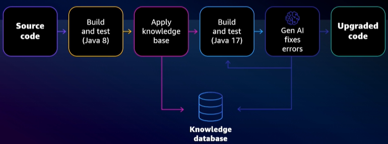
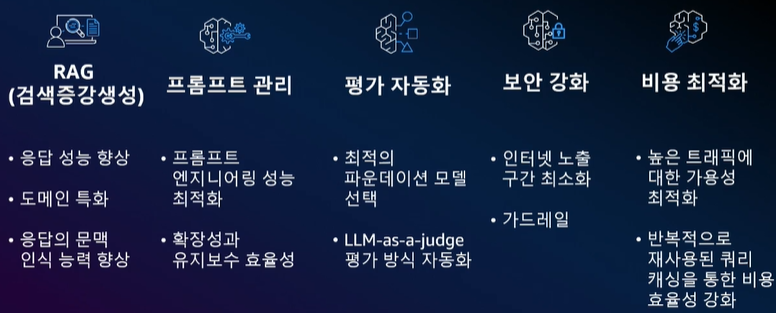

# AWS Summit Seoul 2025

❗일부 내용을 정확히 듣지 못했거나 놓친 부분이 있음

## 1D (5/14)

### 기조 연설
- SA
    - `Apache Iceberg` : S3 기반의 대용량 트랜잭션 데이터 처리를 안정적이고 효율적으로 지원함
    - `Amazon SageMaker` : AI 프로젝트에 필요한 전 과정을 통합 관리할 수 있어 리소스 운영이 용이함

 

- 현대카드
    - 방대한 카드 데이터는 단순한 거래정보를 넘어 개인의 라이프스타일을 반영하는 데이터임
    - 어디에 거주하고, 어떤 직장에 다니며, 어떤 곳을 여행하는지 등 다양한 생활 패턴이 담겨 있음
    - 이러한 데이터를 기반으로 이탈 가능성, 자동차 구매, 백화점 방문 등 고객 행동을 예측하는 다양한 과제가 생겨남
    - 고객이 생성하는 위치, 소비, 라이프스타일 등 예측 가능한 데이터를 활용해 미션을 수행해야 하는 환경이 됨
    - 이를 위해 데이터와 AI가 통합된 자체 플랫폼 UNIVERSE를 구축함
    - UNIVERSE는 AWS 서비스를 활용해 빠르게 개발할 수 있었음
    - 개발된 플랫폼은 일본 2위 카드사 SMCC에 판매함
    - 이 같은 사례를 바탕으로 글로벌 시장으로의 확장을 계획 중임
    - AWS를 활용함으로써 코드 하나로 다양한 리전에 플랫폼을 셋업할 수 있었음
    - AWS의 기술 수준을 자체적으로 따라잡는 건 쉽지 않음
    - 따라서 앞으로도 AWS에 이미 있는 기능들을 적극적으로 활용해 플랫폼을 발전시켜 나갈 예정임

 

- SA
    - `Amazon Nova Foundation Models` : 다양한 업무에 맞는 최적의 모델을 선택할 수 있어, 모델 선택에 대한 고민을 덜어줌
    - `Amazon bedrock` : 보안, 환각(Hallucination) 등 LLM 활용 시 발생할 수 있는 주요 문제들을 효과적으로 완화하고 관리할 수 있음

 

- 트웰브랩스
    - 영상을 텍스트처럼 이해하고 검색할 수 있도록 하는 멀티모달 AI 기술을 연구함
    - 방대한 영상 데이터가 폭발적으로 증가하고 있음
    - 사람들은 영상으로 이야기를 공유하고 소통하지만, 그 영상이 가지고 있는 정보는 실제로 잘 활용되지 못하고 있음
    - 영상은 전체를 분석하려면 시간과 비용이 많이 들기 때문에 쉽게 활용되기 어려운 데이터임
    - 특히 영상 속 맥락, 흐름, 음악, 대사, 목소리 등 다양한 요소를 통합적으로 이해하는 것이 어려움
    - 이 모든 요소를 하나의 텍스트처럼 다루어 영상 전체의 의미와 맥락을 AI가 이해할 수 있도록 모델링하고 있음
    - 이를 통해 스포츠 하이라이트 추출과 같은 콘텐츠 클립 생성 작업을 빠르고 효율적으로 자동화할 수 있음
    - 학습 과정에서는 `Amazon SageMaker`를 활용하여, 모델 학습 중 발생하는 오류나 중단 상황에서도 자동으로 이어서 학습할 수 있도록 안정성을 확보함
    - 현재는 `Amazon Bedrock`과 함께 온보딩 중이며, 다양한 LLM 및 멀티모달 모델을 통합적으로 활용하기 위한 준비를 하고 있음

 

- SA
    - `Amazon Q Developer` : 개발자의 생산성을 높이고 반복 업무를 줄이기 위한 생성형 AI 기반 도구임
    - 코드 생성, 테스트 코드 작성, 문서 요약, 코드 리팩토링 등을 자동화할 수 있음
    - 쿠팡 사례 : 대규모 마이그레이션 작업을 개발자 5명, 3개월 만에 완료함

 

### 여행 및 숙박 - 여행 goes AI! AWS 생성형 AI 없이는 살아남을 수 없어! 

- 상황에 알맞은 올바른 Tool 선택
    - `Amazon Bedrock`을 통해 다양한 생성형 AI 모델을 상황에 맞게 선택할 수 있음
    - TUI(독일) 사례: Llama 모델은 음성 톤 학습에, Claude 모델은 가이드라인 적용에 활용하여 콘텐츠 작성 효율성 및 품질 향상을 달성함

- 강력한 데이터 기반 필요
    - 생성형 AI에만 초점을 맞추는 것은 빙산의 일각에 불과하며, 견고한 데이터 기반이 필수적임
    - Booking.com은 대규모 데이터를 효율적으로 처리하여 서비스 혁신을 이룸
    - Lonely Planet은 책, 여행자 평가 등의 데이터를 LLM에 통합하여 개인화된 여행 콘텐츠(관심 영역, 경험, 여행 일정)를 제공함

 

- 현재 여행 업계는 데이터 품질 문제로 인해 생성형 AI의 활용도가 낮고, 실질적인 성과 도출이 어려움
    - 데이터가 분산되어 있기 때문임
    - 또한, 조직에서 생성형 AI를 어떻게 활용할 지에 대한 사용 사례가 명확하지 않음
    - LATAM 항공 사례: 서비스 장애에 대한 고객 서비스 영역에서 자동화는 25%로 제한적이었음
        - 간단한 질문에 대해서도 국가별로 다양한 지식을 가지고 있어야 함
        - AWS와 함께 국가별 다양한 지식을 갖춘 AI 에이전트 개발을 통해 고객 응대 효율성 향상을 위해 노력함

- 애플리케이션 간 데이터가 분리되어 있어 생성형 AI를 통한 업무 자동화가 어려움
    - 다양한 툴을 사용하여 서로 다른 정보를 취합하여 사용하고 있으나, 취합된 정보를 통합하여 정보를 제공하는 툴은 부족함
    - 분산된 데이터, 데이터의 확산, 인사이트 실행 가능성에 대한 개선이 필요함
    - 이러한 문제를 해결하기 위해 기업 내부 데이터를 활용하는 데 강력한 생성형 AI 서비스인 `Amazon Q Business`를 런칭함

- 기존 레거시 기술로 인해 생성형 AI 프로젝트가 지연되고 있으며, 기술 인재 확보는 어려움 (특히, 유능한 개발자가 호텔 산업을 선호하지 않음)
    - 또한, 개발자는 업무 시간 중 30%만 생산성 있는 업무(서비스 기능 개발 등)를 함
        - 70%는 유지보수, 문서작업 등에 집중되어 있음
    - 이러한 개발자 확보의 어려움과 생산성 향상을 해결하기 위해 `Amazon Q Developer`를 개발함
    - 유나이티드 에어라인 사례: 장기간 방치된 자바 버전을 업그레이드하기 위한 마이그레이션 작업을 5명의 개발자가 평균 10분가량 소요하여 2일 만에 완료함
        - 방대한 규모(약 1,000개의 어플리케이션)의 마이그레이션 작업을 `Code Tansformer` 기능을 사용하여 해결함
        

 

### 리테일 및 소비재 - 생성형 AI 기반 쿠팡 광고의 고객을 위한 혁신
- 엔터프라이즈 환경을 위한 생성형 AI 최적화
    - RAG, 프롬프트 관리, 평가 자동화, 보안 강화, 비용 최적화를 `Amazon Bedrock`을 활용하여 간단하게 해결 가능함
    
    - `Knowledge Bases` 기능을 통해 지식 저장소를 구축하고, 다양한 데이터를 저장하거나 벡터 검색을 수행할 수 있음
    - `Prompt Management`를 통해 프롬프트를 체계적으로 관리할 수 있음
    - `Model Evaluation` 기능을 통해 최적의 파운데이션 모델을 비교 및 선택하고, RAG 워크플로우를 평가할 수 있음
    - `Flows`를 활용해 생성형 AI 개발 워크플로우를 시각화하고, 평가 과정를 자동화함
    - `Guardrails`를 활용하여 민감 정보를 사전에 필터링함
    - `Cross-region Inference`을 통해 여러 리전 간 자동 추론 라우팅이 가능하여 급격한 트래픽 관리가 가능함

- 쿠팡 광고 사례