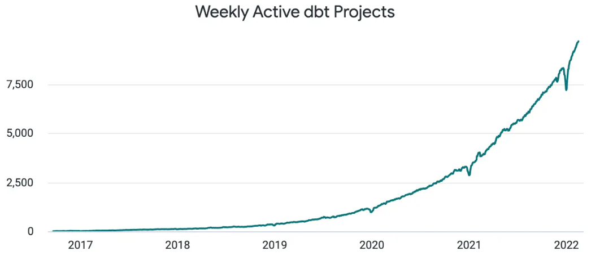

# DBT (Data Build Toos)

## 개념

**1. 데이터 변환이란**
- 데이터를 분석하기 용이하게 바꾸어 주는 과정임
- 예를 들어, 여러 테이블을 하나의 테이블로 정리 하거나, 값의 형태 변경 또는 집계를 하는 과정임
- 이 과정을 통해 데이터 기반으로 회사의 중요한 결정을 더 효과적으로 하기를 기대함

**2. DBT란**
- 데이터 변환(Transformation) 작업을 용이하게 해주는 도구임
- 즉, Raw Data를 변환하여 각 데이터 소비자들에게 필요한 Data Mart를 배포해주는 도구임

**3. 시장 규모**

<글로벌>
- 60K+ 기업이 프로덕션 환경에서 DBT를 사용 중이며, 커뮤니티도 100K+ 명이 활동하며 큼
- 2025년 ARR $100M+ 기록, Fourtune 500 기업 중 전년 대비 85% 더 많이 도입함
    - ARR은 **연간 반복 매출 (Annual Recurring Revenue)**의 약자로, SaaS 및 구독 기반 비즈니스에서 사용되는 주요 지표임

<국내>
- 작년 [DBT 서울 밋업]에서 당근마켓 사례가 공개되면서 업계 관계자들 사이에서 높은 관심을 확인
- 테크 기업, 데이터 플랫폼 회사를 중심으로 빠르게 확산 중

## 특징

**1. DBT 주요 특징**
- Simple : SQL만 알면 사용할 수 있다
- Reliable : 작업 순서와 결과를 자동으로 관리해준다
- Trustworthy : 잘못된 데이터가 없는지 검토해준다
- Collaborative : 여러 사람이 같이 작업해도 혼란이 적다

**2. DBT 장점**
- SQL 기반 데이터 처리의 단점은 코드 관리가 어려운 것이나, DBT는 SQL 코드 관리를 통해 재사용이 용이함
- BigQuery에 데이터를 저장하면 데이터 관리와 모니터링이 어려우나, DBT를 사용하면 데이터 오너쉽을 관리하여 히스토리 추적이 수월함
- DBT [data lineage] 기능을 통해 데이터 의존성 파악(어떤 테이블을 이용해 데이터 마트 또는 테이블이 구성되었는지)이 수월함
    – 엔지니어들이 데이터 파이프라인 구조를 쉽게 이해하고 관리가 가능해짐 

**3. 주의할 점**
- ELT(Extract, Load, Transform) 구조 중에서 Transform 과정을 위해 제작된 도구이므로, 외부 데이터 소스로부터 데이터를 추출하거나 적재하는 기능은 다른 도구를 사용해야함
- 즉, 다른 도구로 데이터가 이미 적재되어 있는 데이터를 조회하고 수정하는 데에 최적화된 도구임
- 또한, 주기적으로 데이터를 업데이트하기 위해서는 Airflow와 같은 도구를 함께 사용해야 함

## 유사 도구

| 도구 | 특징 | DBT 대비 차별점 |
|---|---|---|
| **Dataform** | SQL 기반 데이터 변환 도구로, BigQuery에 최적화된 웹 IDE + Git 연동과 테스트/문서화 기능 포함됨 | DBT와 매우 유사하며, 초기에 설치 없이 바로 사용 가능함. 다만 BigQuery 중심이고 커뮤니티 작음 |
| **SQLMesh** | SQL 중심의 변환 도구로, 가상 개발 환경, 컬럼 단위 의존성 추적, 빠른 롤백 및 배포 기능 포함됨 | 변경 시 전체 재실행 불필요하며, dev/prod 가상 환경을 제공함. 성능 측면에서 DBT보다 빠름 |
| **Dagster** | Python 기반 워크플로우 오케스트레이션 도구로, DBT 통합 또는 대체 가능함 | SQL 변환과 함께 Python, API 등을 포괄적인 파이프라인 구성 가능함 |
| **Apache Airflow** | Python 기반 ETL/CD 워크플로우 오케스트레이션 도구로, DBT 작업 스케줄링에 주로 활용됨 | 변환보다는 파이프라인 관리와 재시도, 의존성 조절에 강함 |
| **Coalesce** | Snowflake 전용 시각적 SQL 변환 도구로, GUI 기반 개발 + Git 지원함 | GUI 중심으로 모델 생성·문서화 과정이 쉬움 |

## 당근 DBT 도입 사례

**도입 배경**
- 데이터 엔지니어링 역량과 도메인 지식을 갖춘 구성원이 신뢰할 수 있는 정보를 만들면 좋겠지만, 현실적으로 적음
- 도메인 지식을 갖고 있는 구성원이 데이터 엔지니어링 역량이 없더라고 직접 데이터 엔지니어링 작업을 수행할 수 있도록 도움을 주기 위해 DBT 도입함

**목표**
- 사용자 정보를 얻기 위해 데이터 클랜징 또는 타팀에 문의하지 않고 원하는 데이터를 조회
- 데이터 엔지니어링 지식 없이도 데이터 간 의존성, 스케줄링, 데이터 퀄리티 테스트, 관측성 등이 갖춰진 데이터 파이프라인 구성

**현황**
- 100개 이상의 중간 테이블 관리에 활용 중
- 작년 [DBT 서울 밋업]에서 사례가 공개되어 업계 관계자들 사이에서 높은 관심을 확인

## 허브스팟 DBT 도입 사례

- 인바운드 마케팅, 영업 및 고객 서비스용 소프트웨어 제품을 개발하고 마케팅하는 미국 기업

**도입 배경**
- 주니어 분석가들이 대다수였으며, 이를 지원할 데이터 엔지니어가 부족했음
- 어려운 코드관리, 데이터 관계 작성, 데이터 이슈 처리 등 문제를 해결하기 위해 Airflow를 도입했으나, 큰 효과를 보지 못함
- 주니어 분석가들을 위해 DBT를 도입함

**목표**
- 용이한 데이터 모델 생성
- 데이터 관계 작성 등 자동화를 통한 업무 효율화

**DBT 도입 전후 평균 소요 시간 비교**

| 이슈 목록 | DBT 도입 전 | DBT 도입 후 |
|---|---|---|
| 모델링 생성 및 배포 | 최소 3-4일 | 최대 3-4시간 |
| 모델링 업데이트 | 최소 3-4시간 | 최대 3-4분 |
| 에러 해결 | 최소 5-6시간 | 최대 5-6분 |
| 코드 관리 | 어려움 | 더 많은 가치를 창출함 |

## Reference

- 
- [DBT 시장 규모](https://www.prnewswire.com/news-releases/dbt-labs-surges-past-100-million-in-annual-recurring-revenue-driven-by-significant-adoption-from-fortune-500-companies-302368083.html?utm_source=chatgpt.com)
- [당근 데이터 가치화팀 Medium 게시글](https://medium.com/daangn/dbt%EC%99%80-airflow-%EB%8F%84%EC%9E%85%ED%95%98%EB%A9%B0-%EB%A7%88%EC%A3%BC%ED%95%9C-7%EA%B0%80%EC%A7%80-%EB%AC%B8%EC%A0%9C%EB%93%A4-61250a9904ab)
- [허브스팟 사례 게시글](https://blog.naver.com/datamarketing/222924918962)

[1]: https://medium.com/refined-and-refactored/dbt-vs-dataform-which-one-should-you-choose-213386ff69dd?utm_source=chatgpt.com "Dbt vs. Dataform: Which one should you choose? - Medium"
[2]: https://medium.com/%40narendrababuoggu393/dbt-vs-dataform-the-data-engineers-guide-52b251e33c9a?utm_source=chatgpt.com "DBT vs Dataform: The Data Engineer's Guide - Medium"
[3]: https://www.synq.io/blog/dbt-vs-sqlmesh-a-comparison-for-modern-data-teams?utm_source=chatgpt.com "dbt vs SQLMesh: A Comparison For Modern Data Teams - SYNQ"
[4]: https://tobikodata.com/blog/tobiko-dbt-benchmark-databricks?utm_source=chatgpt.com "Databricks benchmark study shows SQLMesh outperforms dbt Core ..."
[5]: https://sqlmesh.readthedocs.io/en/stable/comparisons/?utm_source=chatgpt.com "Comparisons - SQLMesh"
[6]: https://www.reddit.com/r/dataengineering/comments/1j5bttx/sqlmesh_versus_dbt_core_seems_like_a_nobrainer/?utm_source=chatgpt.com "SQLMesh versus dbt Core - Seems like a no-brainer"
[7]: https://estuary.dev/blog/dbt-alternatives/?utm_source=chatgpt.com "Top dbt Alternatives & Competitors for Modern Data Teams (2025)"
