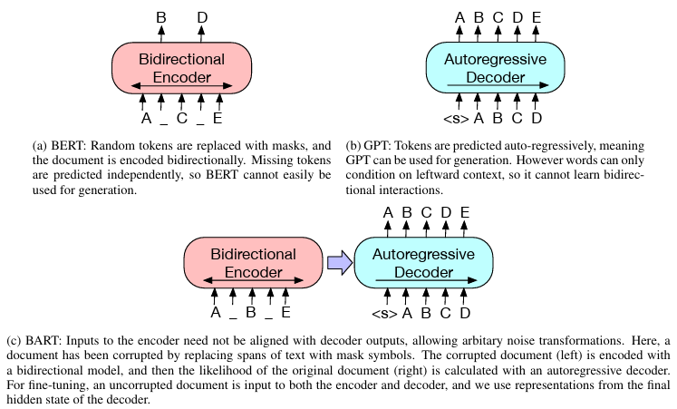

# BART

- 2019년 10월 Facebook에서 발표한 논문임

### 0. Abstract

- BART는 seq2seq 구조를 기반으로 한 [Denosing AutoEncoder](#denosing-autoencoder)임
    - text에 임의의 noise를 주어 변형시키고, 원본 text로 복구하며 모델을 학습시킴
    - 표준 transformer 기반 MNT(Neural Machine Translation) 구조를 사용함
    - 단순한 구조임에도 양방향 encoder인 BERT와 단반향 decoder인 GPT 등 다양한 사전 학습 방식들을 일반화함

- 원본 문장들의 순서를 랜덤하게 섞고, text의 [Spans](#spans)가 하나의 Mask 토큰으로 치환되는 [Text Infilling](#text-infilling) 방식을 사용할 때 가장 좋은 퍼포먼스를 보였음

- BART는 text 생성 작업을 위해 fine tuning 되었을 때 특히 효과적이었지만, 이해력이 요구되는 작업에서도 잘 작동했음

    - [GLUE](#glue), [SQuAD](#squad)에서 유사한 학습 자원을 사용한 [RoBERTa](#roberta)와 성능이 비슷했음
    - 추상적 대화, 질의응답, 요약 작업에서 최고 성능(최대 6 ROUNGE 성과)을 달성함
    - 또한, 기계 번역을 위한 [Back-translation](#back-translation)에서도 target language에 대한 사전학습만으로 1.1 [BLEU](#bleu) (Bilingual Evaluation Understudy) 상승함

***원문***

```
We present BART, a denoising autoencoder for pretraining sequence-to-sequence models.

BART is trained by (1) corrupting text with an arbitrary noising function, 
and (2) learning a model to reconstruct the original text.

It uses a standard Tranformer-based neural machine translation architecture which, 
despite its simplicity, can be seen as generalizing BERT (due to the bidirectional encoder), 
GPT (with the left-to-right decoder), and many other more recent pretraining schemes.

We evaluate a number of noising approaches, 
finding the best performance 
by both randomly shuffling the order of the original sentences and using a novel in-filling scheme, 
where spans of text are replaced with a single mask token.

BART is particularly effective when fine tuned for text generation
but also works well for comprehension tasks.

It matches the performance of RoBERTa with comparable training resources on GLUE and SQuAD, 
achieves new stateof-the-art results on a range of 
abstractive dialogue, question answering, and summarization tasks, with gains of up to 6 ROUGE.

BART also provides a 1.1 BLEU increase over a back-translation system for machine translation, 
with only target language pretraining.

We also report ablation experiments that replicate other pretraining schemes within the BART framework, 
to better measure which factors most influence end-task performance.
```

---

### 1. Introduction

- Self-supervised 방식은 NLP 분야에서 좋은 성과를 보여줬음
    - 가장 성공적인 접근법은 랜덤으로 masked text를 복원하도록 학습하는 denosing autoencoder들, 즉 masked language model의 변형들임

- 최근 연구에서는 masked tokens의 분포, 예측 순서, 대체할 수 있는 context를 개선하는 성과를 보여줌
    - 하지만 이 기법들은 특정 end tasks(span 예측, 생성 등)에 집중해왔으며, 적용 가능성이 제한됨

- 본 논문에서는 양방향과 자기 회귀 transformers가 결합한 사전 학습 모델, BART를 제안함

- BART는 광범위한 end tasks에 적용 가능한 seq2seq 모델로 만들어진 denosing autoencoder임
    - 사전 학습은 text를 임의의 nosing function으로 변형하고, seq2seq 모델이 원본 text로 복구하도록 학습하는 방식으로 진행됨

- BART는 표준 transformer 기반 NMT 구조를 사용함
    - 단순한 구조임에도 양방향 encoder인 BERT와 단방향 decoder인 GPT 등 다양한 최신 사전 학습 방식들을 일반화함 (Figure 1)

- Figure 1 : BERT, GPT, BART 방식 비교
    - BERT는 임의 tokens를 masking 후 양방향으로 문서를 encoding하고, masked tokens를 독립적으로 예측하기 때문에 생성 작업에는 적합하지 않음
    - GPT는 token들을 자기회귀적으로 예측함으로써 생성 작업에 적합하지만, 좌측 context만으로 활용하므로 양방향 상호작용을 학습할 수 없음
    - BART는 encoder 입력과 decoder 출력이 일치할 필요가 없으므로 임의의 noise 변환이 가능함
        - 여기서 문서는 일부 spans가 masking 기호로 대체되어 변형된 상태임
        - 변형된 문서(왼쪽)는 양방향 모델로 encoding된 후 원본 문서(오른쪽)로 자기회귀적으로 decording 되어 계산됨
        - fine-tuning을 위해 손상되지 않은 문서는 encoder와 decoder 모두에 입력되며, decoder의 마지막 hidden state의 표현을 사용함



- 이 방식의 장점은 noising 유연성으로, 원본 text 길이 변경을 포함한 임의의 변형이 가능함

- 다양한 noising 접근법을 평가한 결과, 원본 문장을 랜덤하게 섞은 뒤 길이 0을 포함한 임의 길이의 spans를 하나의 mask token으로 대체하는 새로운 text filling 방식을 사용하는 것이 가장 우수했음
    - 이 접근법은 모델이 전체 문장 길이에 대해 더 많이 추론하고 입력보다 더 긴 변환을 하도록 강제함으로써, BERT의 기존 단어 masking과 NSP(Next Sentence Prediction)를 일반화함

- BART는 text 생성 작업을 위해 fine tuning 되었을 때 특히 효과적이었지만, 이해력이 요구되는 작업에서도 잘 작동했음
    - GLUE, SQuAD와 비슷한 학습 자원에서도 RoBERTa의 성능과 일치했으며, 추상적 대화, 질의응답, 요약 작업에서 최고 성능을 달성함
    - 예를 들어, XSum에서 이전 연구 대비 6 ROUNGE 향상됨

- 또한, BART는 fine-tuning에 대한 새로운 사고 방식을 제시함
    - BART 모델을 몇 개의 추가 transformer layer 위에 쌓는 새로운 기계 번역 방식을 제시함
    - 이 layer들은 기본적으로 외국어를 noise있는 영어로 번역하도록 학습됨

***원문***

```
Self-supervised methods have achieved remarkable success in a wide range of NLP tasks
(Mikolov et al., 2013; Peters et al., 2018; Devlin et al., 2019; Joshi et al., 2019; Yang et al., 2019; Liu et al., 2019).

The most successful approaches have been variants of masked language models, 
which are denoising autoencoders that are trained to reconstruct text 
where a random subset of the words has been masked out.

Recent work has shown gains by improving the distribution of masked tokens (Joshi et al., 2019), 
the order in which masked tokens are predicted (Yang et al., 2019), 
and the available context for replacing masked tokens (Dong et al., 2019).

However, these methods typically focus on particular types of end tasks (e.g. span prediction, generation, etc.), 
limiting their applicability.

In this paper, we present BART, 
which pre-trains a model combining Bidirectional and Auto-Regressive Transformers.

BART is a denoising autoencoder built with a sequence-to-sequence model that is applicable
to a very wide range of end tasks.

Pretraining has two stages (1) text is corrupted with an arbitrary noising function,
and (2) a sequence-to-sequence model is learned to reconstruct the original text. 

BART uses a standard Tranformer-based neural machine translation architecture which, 
despite its simplicity, can be seen as generalizing BERT (due to the bidirectional encoder),
GPT (with the left-to-right decoder), and many other more recent pretraining schemes (see Figure 1).

Figure 1: A schematic comparison of BART with BERT (Devlin et al., 2019) and GPT (Radford et al., 2018).

(a) BERT: Random tokens are replaced with masks, and the document is encoded bidirectionally.
Missing tokens are predicted independently, so BERT cannot easily be used for generation.

(b) GPT: Tokens are predicted auto-regressively, meaning GPT can be used for generation.
However words can only condition on leftward context, so it cannot learn bidirectional interactions.

(c) BART: Inputs to the encoder need not be aligned with decoder outputs, allowing arbitary noise transformations.
Here, a document has been corrupted by replacing spans of text with mask symbols.
The corrupted document (left) is encoded with a bidirectional model,
and then the likelihood of the original document (right) is calculated with an autoregressive decoder.
For fine-tuning, an uncorrupted document is input to both the encoder and decoder,
and we use representations from the final hidden state of the decoder.

A key advantage of this setup is the noising flexibility;
arbitrary transformations can be applied to the original text, including changing its length.

We evaluate a number of noising approaches, finding the best performance 
by both randomly shuffling the order of the original sentences and using a novel in-filling scheme,
where arbitrary length spans of text (including zero length) are replaced with a single mask token.

This approach generalizes the original word masking and next sentence prediction objectives in BERT 
by forcing the model to reason more about overall sentence length and make longer range transformations to the input.

BART is particularly effective when fine tuned for text generation but also works well for comprehension tasks. 

It matches the performance of RoBERTa (Liu et al., 2019) 
with comparable training resources on GLUE (Wang et al., 2018) and SQuAD (Rajpurkar et al., 2016),
and achieves new state-of-the-art results on a range of abstractive dialogue, question answering, and summarization tasks. 

For example, it improves performance by 6 ROUGE over previous work on XSum (Narayan et al., 2018).

BART also opens up new ways of thinking about fine tuning.

We present a new scheme for machine translation
where a BART model is stacked above a few additional transformer layers.

These layers are trained to essentially translate the foreign language to noised English,
by propagation through BART, thereby using BART as a pre-trained target-side language model.

This approach improves performance over a strong back-translation MT baseline
by 1.1 BLEU on the WMT Romanian-English benchmark.

To better understand these effects,
we also report an ablation analysis that replicates other recently proposed training objectives. 

This study allows us to carefully control for a number of factors, 
including data and optimization parameters, which have been shown
to be as important for overall performance as the selection of training objectives (Liu et al., 2019). 

We find that BART exhibits the most consistently strong performance across the full range of tasks we consider.
```

---

# Dictionaly

### Autoencoder

- Autoencoder는 입력 데이터를 압축했다가 다시 복원하는 비지도 학습 모델임
- Encoder는 입력을 잠재 공간(latent space)으로 압축하고, Decoder는 이를 원래 데이터 형태로 복원함
- 주로 차원 축소, 노이즈 제거, 데이터 재구성 등에 활용됨
- 입력과 출력이 동일하도록 학습되며, 그 과정에서 데이터의 중요한 특징을 학습하게 됨
- 변형된 형태로는 Variational Autoencoder(VAE), Denoising Autoencoder 등이 있음

### Denosing Autoencoder

- 일반 Autoencoder는 원본 데이터를 그대로 입력해서 다시 복원하는 방식임
- Denoising Autoencoder는 원본에 일부러 노이즈를 섞은 데이터를 입력으로 사용함
- 출력은 노이즈 없는 원본 데이터를 목표로 학습함
- 즉, DAE는 입력이 손상되더라도 원래 모습을 잘 복원할 수 있도록 학습되는 구조임
- 따라서 일반 Autoencoder보다 더 견고하게 중요한 특징만 잘 추출하는 데 유리함

### Spans

- 연속된 단어나 문장의 조각을 의미함
- 단어 하나가 아니라 여러 단어가 묶여 있는 덩어리를 가리킴
- 단어 단위가 아니라 구(phrase)나 문장 조각 단위로 다뤄질 수 있음

### Text Infilling

- 문장의 일부를 연속적으로 비우고, 그 빈칸을 채우는 작업으로 학습시키는 방식임
- 즉, 단어 하나를 마스킹하는 BERT의 방식이 아니라, 문장 중간을 통째로 비워서 모델이 자연스럽게 복원하도록 학습시키는 방식임

### RoBERTa

- RoBERTa는 페이스북에서 개발한 BERT 개선 버전 모델임
- BERT랑 구조는 같지만 학습 데이터를 훨씬 많이 사용하고, 마스킹 방식도 더 정교하게 조정함
- NSP(Next Sentence Prediction)을 제거하여 성능을 높였음 <br>(NSP task가 실제로 언어 이해 능력 향상에는 큰 도움이 안됨을 실험으로 확인함)

### GLUE

- GLUE는 다양한 NLP 과제를 모아놓은 benchmark 테스트임
- 문장 추론, 유사도, 감정 분류 등 총 9개의 task로 구성되어 있음
- 모델이 얼마나 언어를 잘 이해하는지를 평가하는 데 쓰임
- 많은 모델들이 이 점수를 기준으로 성능을 비교함

### SQuAD

- SQuAD는 QA task를 위한 데이터셋임
- 주어진 지문에서 사용자가 묻는 질문에 답을 찾아야 하는 형식임
- 정답은 보통 지문 안에 존재하는 문장 일부임
- Stanford에서 만든 데이터셋으로 Stanford Question Answering Dataset의 약자임

### Back-translation

- Back-translation은 기계번역에서 자주 쓰이는 데이터 증강 기법임
- Target language 문장을 source langauge로 역번역하여 새로운 훈련 데이터를 생성함

### BLEU

- 기계번역 품질 평가 지표 중 가장 널리 쓰이는 점수임
- 0~100 사이의 점수로, 높을수록 사람 번역과 유사하다는 의미임
- 모델이 생성한 번역 결과와 정답 간의 n-gram 단위 일치도를 평가함


---

# Reference

- [논문](https://arxiv.org/pdf/1910.13461)
- [논문 요약](https://velog.io/@tobigs-nlp/BART-Denoising-Sequence-to-Sequence-Pre-training-for-Natural-Language-Generation-Translation-and-Comprehension)
- [논문 요약2](https://velog.io/@dutch-tulip/BART)