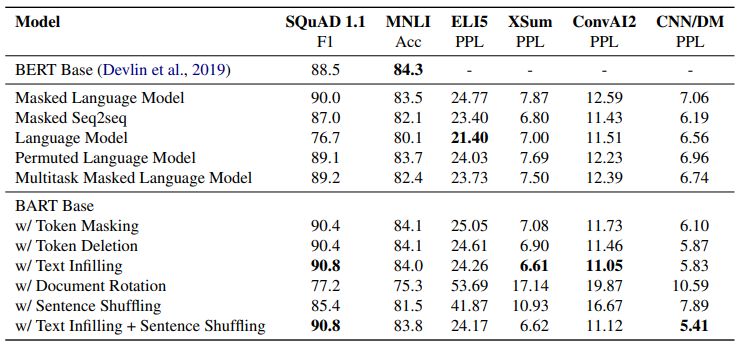
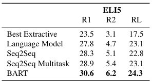
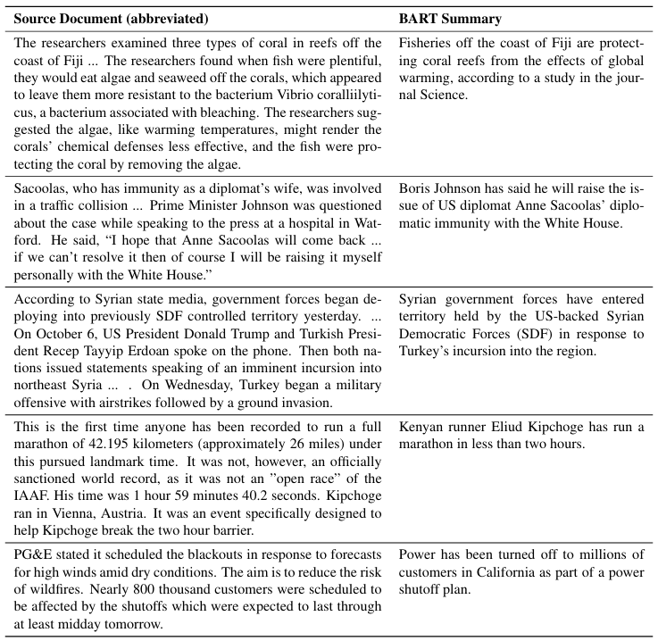

# BART

- 2019년 10월 Facebook에서 발표한 논문임
- Denosing Sequence-to-Sequence Pre-training for Natural Language Generation, Translation, and Comprehension

### Model Architecture

- BART는 **Transformer 기반의 seq2seq 구조**임
    - Encoder는 BERT처럼 양방향(Bidirectional) 방식으로 작동함
    - Decoder는 GPT처럼 자기회귀(Auto-regressive) 방식으로 작동함
- 모델은 **12 encoder/12 decoder layers**로 구성함
- Activation 함수는 [GeLU](#gelu)를 사용함
- Parameter 초기화는 `N(0, 0.02)` 분포를 사용함
- Dropout은 fine-tuning 시 마지막 10% step 동안 비활성화함
- Decoder는 단어 예측 전에 FFN(feed-forword network)를 사용하지 않음

### Pre-training Objective

- BART는 **DAE** ([Denosing Autoencoder](#denosing-autoencoder)) 방식으로 사전 학습됨
    - Noising 함수로 손상된 문서를 원본으로 복원하는 방식으로 학습함 (사전 학습 시에만 nosing 적용함)
    - [Sentence Permutation](#sentence-permutation)과 [Text Infilling](#text-infilling) 기법을 조합하여 사용할 때 가장 우수한 성능을 보였음
    - 즉, 각 문서의 약 30% token을 연속된 span 단위로 masking하고, 모든 문장을 무작위로 섞어 학습함
- Decoder의 출력과 원본 문서 간의 cross-entropy loss, 즉 negative log likelihood를 최소화하는 방향으로 학습됨
- [RoBERTa](#roberta)와 동일하게 뉴스, 서적, 스토리, 웹 등 총 160GB 규모의 데이터를 사용하며, batch size 8,000, **총 50만 step**으로 학습함
- 다양한 noise 유형을 처리하는 능력을 통해 다양한 downstream 작업에 적용 가능함
 
### Fine-tuning Strategy

- BART는 다양한 downstream 작업에 맞춰 end-to-end 방식으로 fine-tuning 할 수 있음

**Discriminative**
- Encoder와 decoder에 동일한 입력을 주며, decoder 마지막에 특별 token을 추가함
- 이 token의 hidden state를 문장 전체의 표현으로 사용하여 분류기에 전달함

**Generation**
- 입력을 encoder에 넣고, decoder가 자기회귀적으로 text를 생성하도록 fine-tuning함
- 학습 시에는 [Label Smoothing](#label-smoothing)이 적용된 cross-entropy loss를 사용하였으며, `smoothing parameter = 0.1`로 설정함
- 추론 시에는 [Beam Search](#beam-search)를 사용하였으며, `beam width = 5`, `length penalty = 1`로 설정함

**Translation**
- BART 앞에 source 단어 임베딩을 BART 입력 공간으로 사상하는 작은 encoder를 추가함
    - 이 encoder는 무작위로 초기화되며, 별도의 단어 집합(source vocabulary)으로 사용할 수 있음
- 먼저 대부분의 BART parameter를 고정하고, 다음 항목만 학습시킴
    - 추가된 encoder
    - BART positional embedding
    - BART encoder 첫 번째 layer의 self-attention projection matrix
- 다음으로 모델의 모든 parameter를 소량의 step으로 fine-tuning함

### Performance Evaluation

- BART는 다양한 benchmark에서 SOTA(state-of-the-art) 또는 경쟁력 있는 성능을 보임
- 생성 작업(summarization, dialogue, QA)에서 우수한 성과를 보이며, 최대 +6 ROUGE 달성함
- 이해 기반 작업(SQuAD, [GLUE](#glue))에서도 RoBERTa와 유사한 성능을 달성함
- 기계 번역 작업에서는 별도 역번역([Back-translation](#back-translation)) 없이도 +1.1 [BLEU](#bleu) (Bilingual Evaluation Understudy) 달성함
- 다양한 noising 방식에 유연하게 대응할 수 있어, 범용성이 높은 모델임
- 다만, 입력과 출력 간 의미적 연결이 약한 작업에서는 효율이 떨어질 수 있음

| Task | Benchmark | Notes |
|---|---|---|
| Discriminative | [SQuAD](#squad), [MNLI](#mnli) | RoBERTa 및 XLNet과 비슷한 성능임 |
| Generation - Summarization | [CNN/DailyMail](#cnndm) | 기존 모델보다 우수함 |
| | [XSum](#xsum) | 최대 **+6 ROUGE** 향상됨, 추상적으로 요약 잘함 |
| Generation - Dialogue | [ConvAI2](#convai2) | 기존 모델보다 우수함 |
| Generation - Abstractive QA | [ELI5](#eli5) | ROUGE-L 기준 1.2점 향상됨, 답변 구성이 부족함 |
| 기계 번역 | WMT14 Ro-En | 역번역 없이도 **+1.1 BLEU** 향상됨 |

---

## Abstract

- BART는 seq2seq 구조를 기반으로 한 DAE임
    - Text에 임의의 noise를 주어 변형시킨 후, 원본 text로 복원하며 모델을 학습시킴
    - 표준 Transformer 기반 MNT 구조를 사용함
    - 단순한 구조임에도 BERT와 GPT를 포함한 다양한 사전 학습 방식을 일반화함
- 원본 문장들의 순서를 무작위로 섞고, span이 하나의 mask token으로 치환되는 기법을 사용할 때 가장 우수한 성능을 보였음
- BART는 text 생성 작업을 위한 fine-tuning에서 특히 효과적이었지만, 이해력이 요구되는 작업에서도 잘 작동함
    - GLUE 및 SQuAD benchmark에서는 RoBERTa와 유사한 학습 자원 하에서 비슷한 성능을 기록함
    - 추상적 대화, 질의응답, 요약 작업에서는 최고 성능(최대 6 ROUGE 포인트 향상)을 달성함
    - 또한, 기계 번역 작업에서는 target 언어에 대한 사전 학습만으로도 역번역 방식보다 1.1 BLEU 향상함

---

## 1. Introduction

- Self-supervised 기법들은 NLP 분야에서 뛰어난 성과를 보여주었음
    - 가장 성공적인 기법은 무작위로 masked text를 복원하도록 학습하는 DAE, 즉 Masked LM(Language Model)의 변형들임
    - 최근 연구에서는 masked token의 분포, 예측 순서, 대체 가능한 문맥을 개선하는 성과를 달성함
    - 하지만 이 기법들은 특정 end task(span 예측, 생성 등)에만 집중하여 적용 가능성이 제한적임
- 본 논문에서는 양방향과 자기회귀 Transformer를 결합한 사전 학습 모델인 BART를 제안함
    - BART는 다양한 end task에 적용 가능한 seq2seq 기반 DAE임
    - 사전 학습은 text를 임의의 nosing 함수로 변형한 후, seq2seq 모델이 원본 text로 복구하도록 학습하는 방식임
    - BART는 표준 Transformer 기반 NMT 구조를 사용함
    - 단순한 구조임에도 양방향 encoder인 BERT와 단방향(좌→우) decoder인 GPT를 포함하여 다양한 최신 사전 학습 방식들을 일반화함 (***Figure 1***)

###### [Figure 1] BERT, GPT, BART 구조 비교


```
(a) BERT는 임의 token을 masking 후 양방향으로 문서를 encoding하고, 
    masked token을 독립적으로 예측하기 때문에 생성 작업에는 적합하지 않음
(b) GPT는 token을 자기회귀적으로 예측하여 생성 작업에는 적합하지만, 
    좌측 문맥만 활용할 수 있어 양방향 상호작용을 학습할 수 없음
(c) BART는 encoder 입력과 decoder 출력이 일치할 필요가 없어 임의의 noise 변환을 적용할 수 있음
    - 이때 문서는 일부 span이 masking 기호로 치환된 상태임
    - 변형된 문서(왼쪽)는 양방향 모델로 encoding되고, 
      이후 원본 문서(오른쪽)로 자기회귀적으로 decording하여 복원함
    - Fine-tuning 시에는 손상되지 않은 문서를 encoder와 decoder에 입력하며, 
      decoder의 마지막 hidden state에서 표현(Representation)을 추출해 사용함
```

- BART의 주요 장점은 noising의 유연성으로, 원본 text 길이 변경을 포함해 다양한 변형이 가능함
    - 다양한 noising 기법을 평가한 결과, 원본 문장을 랜덤하게 섞은 후, 길이 0을 포함한 임의 길이의 span을 하나의 mask token으로 치환하는 기법을 사용하는 것이 가장 우수한 성능 보임
    - 이 기법은 모델이 전체 문장 길이에 대해 더 깊이 추론하고 입력보다 더 긴 변환을 하도록 강제하여, BERT의 원본 단어 masking과 NSP 방식을 일반화함
- BART는 text 생성 작업을 위해 fine-tuning 되었을 때 특히 효과적이었으며, 이해력이 요구되는 작업에서도 잘 작동함
    - GLUE, SQuAD와 같은 benchmark에서는 RoBERTa와 유사한 학습 자원 하에서 비슷한 성능을 기록하고, 추상적 대화, 질의응답, 요약 작업에서 최고 성능을 달성함
    - 예를 들어, XSum benchmark에서는 이전 연구 대비 ROUGE 점수 6점이 향상됨
- 또한, BART는 fine-tuning에 대한 새로운 접근 방식을 제안함
    - BART 모델 위에 몇 개의 추가 Transformer layer를 쌓는 새로운 기계 번역 방식을 제안함
    - 이 layer들은 BART의 전파(Propagation)를 통해 외국어를 Noisy 영어로 번역하도록 학습되며, 이를 통해 BART를 사전 학습된 target 언어 모델로 활용함
        > - BART는 사전 학습할 때 영어 문장을 손상시키고, 그 손상된 영어를 다시 원래 영어로 복원하는 방식으로 학습된 모델임
        > - 즉, noisy 영어를 de-noised 영어로 복구를 잘하는 모델임
        > - 따라서 추가된 Transformer layer로 외국어를 noisy 영어로 변환해주면, BART는 noisy 영어를 de-noised 영어로 자연스럽게 복원함 
    - 이 방식은 WMT Romanian-English benchmark에서 기존 역번역 모델 대비 1.1 BLEU 만큼 성능을 향상시킴
- BART는 다양한 작업에서 일관된 강력한 성능을 보임 

---

## 2. Model

- BART는 손상된 문서를 원본 문서로 복원하는 DAE임
    - 손상된 text를 입력으로 받아, 양방향 encoder와 단반향(좌→우) 자기회귀 decoder를 갖춘 seq2seq 모델로 구현됨
    - 사전 학습은 원본 문서에 대한 negative log likelihood를 최소화하는 방식으로 진행됨

### 2.1 Architecture

- BART는 표준 seq2seq Transformer 구조를 사용함
    - GPT와 동일하게 activation 함수를 ReLU 대신 GeLU로 변경하고, parameter를 N(0, 0.02) 분포로 초기화함
    - 기본 모델은 6개의 encoder와 decoder layer를 사용하고, 대형 모델은 12개의 layer를 사용함
- BART 구조는 BERT와 밀접한 관련이 있지만 다음과 같은 차이점이 있음
    - Decoder의 각 layer는 encoder의 마지막 hidden layer에 대해 추가적인 cross-attention을 수행함
    - BERT는 단어 예측 전에 FFN을 추가로 사용하지만, BART는 사용하지 않음
    - 전체적으로 BART는 동일 크기의 BERT 모델보다 약 10% 더 많은 parameter를 가짐

### 2.2 Pre-training BART

- BART는 문서를 손상시킨 후, decoder 출력과 원본 문서 간의 cross-entropy loss를 최소화하는 방식으로 학습됨
- 특정 noising 방식에만 최적화된 기존 DAE와 달리, BART는 다양한 유형의 손상된 문서를 학습에 활용할 수 있음
    - 원본 정보를 모두 잃은 경우, BART는 일반적인 언어 모델과 동일하게 동작함
    - 잠재력이 있는 새로운 noising 변형 기법을 실험함

##### Token Masking
- BERT와 동일하게, 무작위로 token을 선택하여 `Mask`로 치환함

##### Token Delection
- 입력에서 무작위로 token을 제거하고, 어떤 위치에서 입력이 누락되었는지 판단함

##### Text Infilling
- Poisson 분포 (λ = 3)를 기반으로 span 길이를 sampling하여 무작위로 text span을 선택하고, 각 span을 하나의 `Mask` token으로 치환함
- 길이가 0인 span도 `Mask` token으로 치환될 수 있음
- SpanBERT에서는 geometric 분포를 통해 sampling하고, 각 span을 동일 길이의 `Mask` token으로 치환하는 방식을 제안함
- Text Infilling 기법은 모델이 하나의 span 내에서 얼마나 많은 token이 누락되었는지 예측함

##### Sentence Permutation
- 문서를 마침표(Full Stop) 기준으로 문장을 나누고, 그 문장들을 무작위로 섞음

##### Document Rotation
- 문서에서 무작위로 하나의 token을 선택하여 해당 token으로 문서가 시작되도록 회전시키고, 모델이 문서의 시작을 식별하도록 학습시킴

###### [Figure 2] 입력 text에 대한 여러 형태의 noisy 변환은 조합하여 적용할 수 있음


---

## 3. Fine-tuning BART

- BART가 생성한 표현은 다양한 downstream 작업에 활용될 수 있음

###### [Figure 3] 분류 및 번역을 위한 BART의 fine-tuning 구조


```
(a) 분류 문제에서 BART는 encoder와 decoder에 동일한 입력을 주고, 마지막 출력의 표현을 사용함
(b) 기계 번역에서는 BART 앞에 word embedding을 위한 작은 encoder를 추가로 학습시키며, 
    이 추가된 encoder는 별도의 단어 집합(Vocabulary)으로 사용할 수 있음
```

### 3.1 Sequence Classification Tasks

- Sequence 분류 시에는 encoder와 decoder에 동일한 입력을 주고, decoder의 마지막 hidden state를 multi-class 분류기에 입력함
    - 이 작업은 BERT의 [CLS token](#cls-token)을 사용하는 방식과 유사함
    - 다만, BART는 decoder 입력의 끝에 특정 token을 추가하며, 이 token의 표현이 decoder가 처리한 입력 sequence에 attention 할 수 있도록 설계됨 (***Figure 3a***)
        > - Decoder 입력에 추가된 token의 최종 hidden state가 입력 sequence를 요약한 표현이 되도록 유도함

### 3.2 Token Classification Tasks

- Token 분류 시에는 SQuAD의 정답 endpoint 분류와 유사하게, 전체 문서를 encoder와 decoder에 입력한 뒤, 각 단어의 표현이 포함된 decoder의 상단 hidden state를 활용해 분류를 수행함

#### 3.3 Sequence Generation Tasks

- BART는 자기회귀 decoder를 갖추고 있어, 추상적인 질의응답과 요약과 같은 sequence 생성 작업을 직접 수행할 수 있음
    - 이 두 작업은 정보를 입력으로부터 복사해 활용하며, denoising 사전 학습 방식과 밀접하게 연관되어 작동함
        > - BART의 사전 학습 방식은 noisy 데이터를 복원하는 학습임 (denosing)
        > - 따라서 질의응답이나 요약처럼 입력 일부를 기반으로 출력을 생성하는 작업은 BART의 학습 구조 자체가 잘 맞아 떨어짐
    - 이때 encoder의 입력은 입력 sequence이며, decoder는 자기회귀적으로 출력을 생성함

### 3.4 Machine Translation

- BART는 영어 번역을 위한 기계 번역 decoder의 성능을 향상시킴
    - 선행 연구 Edunov et al. (2019)에서는 사전 학습된 encoder를 통합하여 성능을 향상시켰지만, decoder의 사전 학습 LM 이점은 제한적이었음
- Bitext *(source와 target 언어가 1:1로 매핑된 문자쌍)* 로 학습된 encoder parameter set을 새로 추가하여, BART(encoder와 decoder 모두)가 기계 번역을 위한 하나의 사전 학습된 decoder로 사용 가능함 (***Figure 3b***)
    - 보다 정확히는, BART의 embedding layer를 무작위로 초기화된 새로운 encoder로 교체함
    - 추가된 encoder는 외국어 단어를 BART가 복원 가능한 형태의 입력 *(noisy 영어)* 으로 바꾸어 주도록 학습함
- 추가된 source encoder는 두 단계로 학습하며, 역전파(Backpropagation)는 BART 출력에 대한 cross-entory loss임
    - 먼저 BART의 대부분 parameter를 고정하고, 무작위로 초기화된 source encoder와 BART positional embedding, BART encoder 첫 번째 layer의 self-attention 입력 projection matrix를 업데이트함
    - 다음으로 작은 수의 iteration으로 모델의 모든 parameter를 학습함 (end-to-end 학습)

---

## 4. Comparing Pre-training Objectives

- BART는 이전 연구 보다 다양한 noising 기법을 사전 학습에 활용할 수 있음
- 기본 모델(6-layer encoder와 6-layer decoder, 768개의 hidden)을 사용하여 다양한 방식을 비교함
    - 5장에서 다룰 대규모 실험의 일부 작업을 기준으로 평가됨

### 4.1 Comparision Objectives

- 그동안 다양한 사전 학습 방식(Objective)이 제안되었지만, 학습 데이터와 자원, 모델 구조, fine-tuning 절차의 차이로 인해 모델 간의 성능을 공정하게 비교하기는 어려움
- 이에 본 연구에서는 판별 및 생성 작업을 위해 제안된 최근 주요 사전 학습 방식을 재구현함
    - 공정한 비교를 위해 사전 학습 방식 외의 요소는 최대한 통제함
    - 다만, learning rate와 layer 정규화 사용은 성능 향상을 위해 (각 방식에 맞게 별도로 조정하여) 미세하게 변경함
    - 참고로, 구현된 방식은 다양한 서적과 wikipedia 데이터로 100만 step 학습된 BERT와 비교함
        > - BART 구조에 다양한 사전 학습 방식을 적용시켜 BERT와 비교함
        > - BART의 DAE와 다른 사전 학습 방식을 비교하기 위함임

##### Language Model
- GPT와 유사하게 단반향(좌→우) Transformer 언어 모델을 학습함
- 이 모델은 cross-attention이 제거된 BART decoder와 동일함

##### Permuted Language Model
- XLNet 기반으로, 전체 token 중 1/6을 sampling하여 무작위 순서(Permutation)로 배열하여 자기회귀적으로 token을 생성함
- 다른 모델과의 일관성을 위해 XLNet의 relative positional embedding이나 segment 간 attention은 구현하지는 않음

##### Masked Language Model
- BERT와 동일하게, 전체 token 중 15%를 `MASK`로 치환하여 모델이 원래 token을 독립적으로 예측하도록 학습시킴

##### Multitask Masked Language Model
- UniLM에서 제안된 방식으로, 다양한 self-attention mask 유형을 적용해 Masked LM을 학습시킴
- self-attention mask 유형은 다음과 같은 비율로 무작위 선택됨
    - 1/6은 좌→우 mask
    - 1/6은 우→좌 mask
    - 1/3은 unmasked *(양방향)*
    - 1/3은 token sequence의 앞 50%는 unmasked, 나머지는 좌→우 mask

##### Masked Seq-to-Seq
- MASS에서 영감을 받아, 전체 token sequence 중 50%를 차지하는 span *(연속된 token)* 을 masking하고 해당 span을 예측하도록 seq2seq 모델을 학습시킴

<br>

- Permuted LM, Masked LM, Multitask Masked LM은 sequence 출력의 likelihood를 효율적으로 계산하기 위해 [Two-stream Attention](#two-stream-attention)을 사용함
    > - 일반적인 자기회귀 방식은 한 token 씩 순차적으로 예측하므로 비효율적으로 계산됨
    > - Two-stream 구조는 전체 target sequence의 likelihood를 동시에 계산할 수 있음
    - 이때 decoder 출력에는 단어를 왼쪽에서 오른쪽으로 예측하도록 diagonal self-attention mask를 사용함
- 두 가지 fine-tuning 방식을 실험함
    - (1) Encoder 입력은 source, decoder 출력은 target인 표준 seq2seq 문제를 처리하는 방식
    - (2) Target 앞에 source를 추가하여 decoder에 입력하며, sequence의 target 부분만 loss로 계산하는 방식
        > - Decoder에 [질문 + 답변] 형태의 sequence가 입력되며, loss는 정답 부분만 계산함
        > - GPT나 XLNet 같은 decoder-only 모델이 주로 사용하는 방식임
    - (1) 방식은 BART가, (2) 방식은 다른 모델이 더 잘 작동됨 

### 4.2 Tasks

##### SQuAD
- Wikipedia에서 추출된 질의응답 데이터셋으로, 정답은 주어진 문서 내에서 추출된 text span임
- BART는 BERT와 유사하게 질문과 문맥을 encoder 입력으로 사용하며, decoder에도 이를 입력함
- 이 모델은 정답의 시작 및 종료 token 위치를 예측하는 분류기가 포함되어 있음

##### MNLI
- 한 문장이 다른 문장을 수반하는지 예측하는 bitext 분류 작업임
- Fine-tuning된 모델은 EOS token을 포함하여 두 문장을 연결하고, BART의 encoder와 decoder에 이들을 입력함
- BERT와 달리 EOS token의 표현을 문장 간 관계 분류에 사용함

##### ELI5
- 장문의 추상적 질의응답 데이터셋으로, 모델은 질문 및 관련 문서를 조합하여 답변을 생성함

##### XSum
- 뉴스 요약 데이터셋이며, 매우 추상적으로 요약됨

##### ConvAI2
- 대화 응답 생성 작업으로, 문맥과 AI 인물 정보(Persona)를 조합함

##### CNN/DM
- 뉴스 요약 데이터셋으로, 원문과 밀접하게 연관되어 요약됨

### 4.3 Results

**사전 학습 방식의 성능은 작업별로 상당히 상이함**
- 사전 학습 방식의 유효성은 downstream 작업에 따라 크게 달라짐
- 예를 들어, 기본 LM은 ELI5에서는 가장 우수한 성능을 보였지만, SQuAD에서는 가장 낮은 성능을 기록함

**Token masking은 핵심 요소임**
- 문서를 회전시키거나 문장 순서를 섞는 방식의 사전 학습은 성능이 매우 낮았음
- Token을 제거하거나 masking하는 방식과 self-attention mask를 사용하는 방식이 성공적이었음
- 특히 생성 작업에서는 token 제거 방식이 masking 방식을 능가함

**단방향(좌→우) 사전 학습은 생성 성능을 향상시킴**
- Masked LM과 Permuted LM은 사전 학습 시 단방향(좌→우) 자기회귀 LM 구조을 사용하지 않아, 생성 작업에서 성능이 낮았음

**양방향 Encoder는 SQuAD 작업에서 중요함**
- BERT에서 언급했듯이, 분류 결정에서 이후 문맥은 중요하기 때문에 단방향(좌→우) decoder는 SQuAD 성능이 낮았음 
- 하지만 BART는 절반의 양방향 Layer로 BERT와 유사한 성능을 달성함
    > - BERT는 12-layer encoder(양방향) 구조임
    > - BART는 6-layer encoder(양방향)와 6-layer decoder(단방향) 구조임

**사전 학습 방식만으로 성능을 결정짓는 요소는 아님**
- Permuted LM은 XLNet 보다 성능이 나빴음 
- 다만, relative-position embedding과 segment-level attention이 구현되지 않았기 때문일 수 있음

**기본 LM은 ELI5에서 성능이 가장 우수함**
- ELI5는 이례적인 결과이며, 다른 모델이 BART를 능가하는 유일한 생성 작업임
- 기본 LM이 가장 우수했으며, BART는 출력이 입력과의 의미적 연결이 약할 때 비효율적일 수 있음
    > - BART는 입력을 복원하거나, 입력 기반으로 출력을 구성하는 데 최적화되어 있음
    > - 따라서 입력에 구속받지 않고 자유롭게 생성해야 하는 경우 한계가 있을 수 있음
    > - ELI5는 질문이 짧고 답변이 장문이기 때문에 추상적으로 새로운 문장을 생성하는 능력이 필요함

**BART는 가장 일관성있는 우수한 성능을 달성함**
- Text Infilling 방식을 사용한 BART 모델은 ELI5을 제외한 모든 작업에서 잘 작동함

###### [Table 1] 사전 학습 방식 비교

```
- 모든 모델은 유사한 크기이며, 서적과 wikipedia 데이터를 조합하여 100만 step 학습됨
- 아래 두 블록의 항목은 동일한 코드 기반으로 동일한 데이터로 학습되었으며, 동일한 절차로 fine-tuning 되었음
- 두번째 블록의 항목은 이전 연구에서 제안된 사전 학습 방식에 영감을 받았지만, 평가 목표에 초점을 맞추어 단순화됨
- 성능은 작업별로 상당한 차이를 보이지만, Text Infilling을 적용한 BART 모델이 가장 일관성있게 우수한 성능을 보여줌
```

---

## 5. Large-scale Pre-training Experiments

- 최근 연구에서는 큰 batch size와 방대한 말뭉치(Corpus)를 사전 학습시켰을 때 downstream 성능이 극적으로 향상됨을 보여줌
- 이에 따라 BART 성능을 정확하게 평가하고, downstream 작업에 실질적으로 유용한 모델로 만들기 위해 RoBERTa와 동일한 규모로 BART를 학습시킴

### 5.1 Experimental Setup

- BART는 12-layer encoder와 12-layer decoder, hidden size 1,024개로 구성된 대규모 모델을 학습함
- RoBERTa와 동일하게 batch size 8,000개, 총 50만 step으로 사전 학습을 수행함
- 문서는 GPT-2 tokenizer를 사용해 문서 단위로 쌍을 이루어 encoding됨
- 4장의 결과를 바탕으로 Text Infilling과 Sentence Permutation 기법의 조합을 사용함
    - 각 문서의 약 30% token을 masking하고, 모든 문장을 무작위로 섞음
    - Sentence Permutation 방식이 CNN/DM 요약 작업에서만 추가 이점을 보였지만, 이 방식으로 대규모 사전 학습 모델이 더 잘 학습될 수 있다고 가정함
- 모델이 데이터에 더 잘 적합되도록 학습 후반 10% step은 dropout을 사용하지 않음
- 사전 학습 데이터는 RoBERTa와 동일하게 뉴스, 서적, 스토리, 웹 등 총 160GB 규모를 사용함

### 5.2 Discriminative Tasks
- 동일한 자원으로 사전 학습된 RoBERTa가 가장 직접적인 비교 기준이지만, 사전 학습 방식에는 차이가 있음
- 전반적으로 BART는 유사한 수준의 성능을 보였으며, 대부분의 작업에서 모델 간 성능 차이는 미미함
    - 이는 생성 작업을 위한 BART가 분류(판별) 성능도 경쟁력 있음을 시사함

###### [Table 2] SQuAD 및 GLUE 작업에 대한 대규모 모델 성능 비교

```
BART는 판별 작업에서 단방향 decoder layer의 성능이 저하되지 않았으며, RoBERTa 및 XLNet과 비슷한 성능임
```

### 5.3 Generation Tasks

- BART는 입력 text로부터 출력 text를 생성하는 표준 seq2seq 모델로 fine-tuning 되었음
- Fine-tuning 시에는 label smoothing이 적용된 cross-entropy loss를 사용하였으며, smoothing parameter는 0.1로 설정함
- Text 생성 시에는 beam size를 5로 설정하고, beam search 과정에서 중복된 trigram은 제거함
    > - 매 token 생성 시 마다 확률이 높은 5개의 문장을 후보로 두고, 마지막에 가장 확률이 높은 문장을 고름
    > - 문장의 질을 높이기 위해 3개 연속 반복되는 token이 포함된 문장은 제거함
- 평가 데이터셋은 최소/최대 길이 및 길이 보정 계수(Length Penalty)를 적용함
    > - Token을 생성할수록 전체 확률이 작아져 모델이 짧은 문장을 더 선호할 수 있음
    > - 이런 상황을 보정해주기 위해 text 길이 관련 parameter를 설정함

##### Summarization

- 최신 요약 모델들과 비교하기 위해, 서로 다른 특성을 가진 두 개의 요약 데이터셋 CNN/DailyMail과 XSum에 대한 실험 결과를 제시함
- CNN/DailyMail의 요약은 원문과 유사한 경향이 있음
    - 추출 기반 모델이 이 데이터셋에서 잘 작동했으며, 기준점인 Lead-3 *(첫 세 문장을 추출하는 방법)* 도 상당히 경쟁력이 있었음
    - 그럼에도 BART는 기존 모델들을 능가함
- 반면에 XSum의 요약은 매우 추상적이며, 추출 기반 모델은 성능이 급격히 떨어짐
    - BART는 기존 BERT 기반 모델보다 모든 ROUGE 지표에서 약 6점 더 높은 성능을 보였으며, 해당 작업에서 매우 우수한 결과를 나타냄
    - 생성된 샘플의 질도 매우 뛰어남

###### [Table 3] 두 가지 표준 요약 데이터셋 결과

```
BART는 요약 작업에서 기존 최고 모델을 능가했으며, 
특히 더 추상적인 데이터셋에서는 약 6 points 높은 성능을 기록함
```

##### Dialogue
- ConvAI2 작업에서 질의응답 생성 성능을 평가하였으며, 이전 문맥과 AI 인물 정보(Persona)를 반영하여 응답을 생성함
- BART는 두 가지 정량 평가 지표에서 기존 최고 모델을 능가함

###### [Table 4] ConvAI2 성능 비교

```
- BART는 질의응답 생성 작업에서 기존 모델을 능가함
- 복잡성 계산은 ConvAI2의 공식 Tokenizer를 기준으로 재정규화됨
```

##### Abstractive QA

- 최근 제안된 ELI5 데이터셋을 활요하여 모델의 긴 자유형 답변 생성 능력을 평가함
- BART는 기존 최고 모델보다 ROUGE-L 기준 1.2점 더 높았지만, 질문에 대한 답변의 구성이 부족하여, 이 데이터셋은 여전히 까다로운 과제로 남아 있음

###### [Table 5] ELI5 성능 비교

```
BART는 추상적 질의응답 데이터셋인 ELI5에서 최고 성능을 기록함
```

### 5.4 Translation

- 역번역으로 증강된 **WMT16 Romanian-English** 데이터셋에서 성능을 평가함
    - 3.4 섹션에서 소개한 방식을 따라, 루마니아어를 BART가 de-noised 영어로 복원할 수 있도록, 6-layer Transformer 기반의 source encoder를 학습함
- 표준 Transformer 모델을 기준선으로 BART의 두 단계인 `Fixed BART`와 `Tuned BART` 성능을 비교함
    - 모든 모델은 역번역으로 증강된 데이터셋으로 실험함
    - `beam width = 5`, `length penalty = 1` 설정을 사용함
    - 예비 실험 결과, 역번역 데이터 없이 학습하는 경우 성능이 낮고 과적합(Overfitting) 경향이 있음
    - 향후 연구에서는 추가적인 정규화 기법을 탐구해야 함

###### [Table 6] WMT16 RO-EN 성능 비교 (BLUE)

```
BART는 영어만으로 사전 학습하여 역번역 기준선을 개선함
```

---

## 6. Qualitative Analysis

- BART는 요약 작업에서 기존 최고 성능 대비 최대 6점의 향상을 달성함
- 정량 평가 지표 외에도, BART의 성능을 이해하기 위해 생성 품질을 분석함
- ***[Table 7]*** 은 BART가 생성한 요약문 예시임
    - 예시는 모델의 학습 데이터에 설명된 내용이 존재할 가능성을 배제하도록 사전 학습 말뭉치를 생성한 이후에 게시된 WikiNews 기사에서 발췌함
    - 요약하기 전에 기사의 첫 문장을 제거하여 문서의 요약을 쉽게 추출할 수 없도록 함

###### [Table 7] XSum으로 tuning된 BART에 WikiNews 기사를 적용한 예시 요약

```
- 명확성을 위해 출처와 관련된 부분만 발췌함
- 요약은 기사 전체의 정보와 배경 지식을 결합한 것임
```

- 예상대로 BART의 출력은 유창하고 문법에 맞는 영어임
    - 출력은 매우 추상적이어서 입력에서 복사된 문구가 거의 없음
    - 출력은 일반적으로 사실적으로 정확하며, 입력 문서 전반의 뒷받침 증거와 배경 지식(예: 이름 정확하게 완성하거나 PG&E가 캘리포니아에서 운영됨을 추론)을 통합함
- 첫 번째 예시에서 물고기가 지구 온난화로부터 산호초를 보호하고 있다는 추론은 text에서의 쉽지 않은 추론이 필요함
    - 다만, 해당 연구가 Science에 게재되었다는 주장은 출처에서 뒷받침되지 않음 *(hallucination)*
- 이러한 예시는 사전 학습된 BART가 자연어 이해와 생성의 강력한 조합을 학습되었음을 보여줌

---

## 7. Related Work

- 초기 사전 학습 방식은 LM 기반임
    - `GPT`는 좌측 문맥만 학습하며, 이는 일부 작업에서 문제가 될 수 있음
    - `ELMo`는 좌측 전용 표현과 우측 전용 표현을 결합하지만, 이 특징들 간의 상효작용은 사전 학습하지 않음
    -  Radford et al.(2019) 연구는 대규모 LM이 비지도 학습된 다중 작업 모델로 작동할 수 있음을 보여줌
- `BERT`는 좌우 문맥 단어 간의 상호작용을 사전 학습할 수 있도록 Masked LM 방식을 소개함
    - 최근 연구에서는 더 긴 학습 시간, layer 간 parameter 공유, 단어 대신 span masking을 통해 강력한 성능을 보여줌
    - 다만, `BERT`는 예측이 자기 회귀적으로 이루어지지 않으므로 생성 작업에서는 비효율적임
- `UniLM`은 다양한 mask 방식의 조합으로 `BERT`를 fine-tuning하여, 그중 일부는 왼쪽 방향의 문맥만 허용함
    - `BART`와 유사하게, `UniLM`은 생성 및 판별 작업 모두에 사용할 수 있음
    - 차이점은 `UniLM` 예측은 조건부 독립인 반면, `BART` 예측은 자기회귀적임
    - `BART`는 decoder가 항상 손상되지 않은 문맥을 학습하므로, 사전 학습과 생성 작업 간의 불일치를 줄임
- `MASS`는 `BART`와 가장 유사한 모델임
    - 연속된 masked span로 구성된 입력 sequence를 누락된 token으로 구성된 sequence로 변환시킴
    - `MASS`는 분리된 token set이 encoder와 decoder에 입력되어 판별 작업에서는 효과적이지 않음
- `XL-Net`은 무작위 순서의 masked token을 자기회귀적으로 예측함으로써 `BERT`를 확장함
    - 이 방식은 좌우 문맥을 모두 적용하여 예측됨
    - 반면, `BART`는 decoder가 사전 학습 과정에서 좌에서 우로 동작하며, 생성 과정에서는 설정에 맞춰 작동함
- 여러 연구에서는 사전 학습된 표현을 사용하여 기계 번역을 개선하는 방법을 탐구함
    - 가장 큰 개선은 source와 target 언어에 대한 사전 학습을 수행할 때 보여지지만, 이는 모든 언어에 대한 사전 학습이 필요함
    - 다른 연구에서는 사전 학습된 표현을 사용하여 encoder가 개선될 수 있음을 보여주었지만, decoder의 이점은 제한적이었음
    - 본 연구에서는 `BART`가 기계 번역 decoder를 개선할 수 있는 방법을 보여줌

---

## 8. Conclusions

- 본 논문은 손상된 문서를 원본으로 복원하도록 사전 학습된 BART를 소개함
- BART는 판별 작업에서 RoBERTa와 유사한 성능을 달성하였으며, text 생성 작업에서 SOTA(state-of-the-art)를 달성함
- 향후 연구는 사전 학습 단계에서의 손상된 문서를 복원하기 위한 새로운 기법과 특정 end task에 최적화된 fine-tuning 전략을 탐구해야 함

---

## Dictionaly

### Denosing Autoencoder

- 일반 Autoencoder는 원본 데이터를 그대로 입력해서 다시 복원하는 방식임
- Denoising Autoencoder는 원본에 일부러 노이즈를 섞은 데이터를 입력으로 사용함
- 출력은 노이즈 없는 원본 데이터를 목표로 학습함
- 즉, DAE는 입력이 손상되더라도 원래 모습을 잘 복원할 수 있도록 학습되는 구조임
- 따라서 일반 Autoencoder보다 더 견고하게 중요한 특징만 잘 추출하는 데 유리함

### Span

- 연속된 단어나 문장의 조각을 의미함
- 단어 하나가 아니라 여러 단어가 묶여 있는 덩어리를 가리킴
- 단어 단위가 아니라 구(phrase)나 문장 조각 단위로 다뤄질 수 있음

### RoBERTa

- RoBERTa는 페이스북에서 개발한 BERT 개선 버전 모델임
- BERT랑 구조는 같지만 학습 데이터를 훨씬 많이 사용하고, 마스킹 방식도 더 정교하게 조정함
- NSP(Next Sentence Prediction)을 제거하여 성능을 높였음 <br>(NSP Task가 실제로 언어 이해 능력 향상에는 큰 도움이 안됨을 실험으로 확인함)

### Label Smoothing

- Label smoothing은 분류 문제에서 과적합을 줄이기 위한 정규화 기법임
- 전체 class 수 K가 있을 때, smoothing parameter $\alpha$를 이용해 다음과 같이 분포를 재조정함
    - 정답 클래스: $ ( 1 - \alpha + \frac{\alpha}{K} ) $
    - 나머지 클래스: $ ( \frac{\alpha}{K} ) $

- 정답 class에만 1.0을 주는 one-hot label 대신, 일부 확률을 다른 class에도 분산시킴 
    - One-hot : [0, 0, 1, 0, 0]
    - Label smoothing : [0.02, 0.02, 0.92, 0.02, 0.02]  , `smoothing parameter = 0.1`일 경우
- 모델이 정답에 대해 지나치게 확신하지 않도록 조절하여 일반화 성능을 높임  
- BART 논문에서는 fine-tuning 과정에서 label smoothing을 적용해 안정적인 학습과 다양한 문장 생성을 유도함

### Beam Search

- Beam search는 text 생성 모델에서 가장 가능성 높은 문장을 찾기 위한 탐색 알고리즘임  
- 매 단계마다 확률이 높은 후보들을 여러 개(`beam width`만큼) 유지하며 탐색을 진행함  
- 단순히 가장 높은 확률의 단어만 고르는 Greedy Search보다 더 나은 전체 시퀀스를 생성할 수 있음  
- `Beam width`가 클수록 더 많은 경로를 고려하므로 정확도는 높아지지만 계산 비용도 증가함

### GLUE

- GLUE는 다양한 NLP 과제를 모아놓은 benchmark 테스트임
- 문장 추론, 유사도, 감정 분류 등 총 9개의 Task로 구성되어 있음
- 모델이 얼마나 언어를 잘 이해하는지를 평가하는 데 쓰임
- 많은 모델들이 이 점수를 기준으로 성능을 비교함

### Back-translation

- Back-translation은 기계번역에서 자주 쓰이는 데이터 증강 기법임
- Target language 문장을 source langauge로 역번역하여 새로운 훈련 데이터를 생성함

### BLEU

- 기계번역 품질 평가 지표 중 가장 널리 쓰이는 점수임
- 0~100 사이의 점수로, 높을수록 사람 번역과 유사하다는 의미임
- 모델이 생성한 번역 결과와 정답 간의 n-gram 단위 일치도를 평가함

### GeLU

- Gaussian Error Linear Units
- $ GeLU(x) = xP(X \leq x) =  x \Phi(x) = x \cdot \frac{1}{2}[1+erf(\frac{x}{\sqrt{2}})]$
    - $ \Phi(x) $ : CDF (Standard Gaussian Cumulative Distribution Function)
    - CDF를 사용하여 입력값 크기에 따라 확률적으로 가중치를 부여함
    - $ erf(x) = \frac{2}{\sqrt{\pi}} \int_{0}^{x} e^{-t^2} \, dt $ : Error Function
- $ GeLU(x) \approx 0.5x \left( 1 + \tanh\left( \sqrt{\frac{2}{\pi}} \left( x + 0.044715x^3 \right) \right) \right) $
    - 계산 비용이 비싸기 때문에 $ tanh $ 기반 근사식을 사용하기도 함

### CLS token

- `CLS` token은 BERT와 같은 encoder-only 모델에서 입력 sequence의 맨 앞에 추가되는 token임
- 이 token이 전체 문장의 대표 표현(문맥 요약 벡터)로 사용됨
- 주로 문장 분류, 문장 간 관계 판단, 감성 분석 작업에서 활용됨
- BERT는 `CLS` token의 표현을 이용해 분류기의 입력으로 사용함
- 단어별 의미가 아닌, 문장 또는 문서 전체를 대표하는 벡터 역할로 기대함

### Two-stream Attention

- Two-stream Attention은 Permutation 기반 언어 모델에서 예측 위치의 불확실성을 해결하기 위해 도입됨
- 전체 Attention 구조를 Query Stream과 Content Stream으로 분리하여 구성함
    - Query Stream은 Target 위치와 해당 위치 이전 Token의 정보만 활용하여 학습됨 (Target Token 사용 안함)
    - Content Stream은 Target Token까지 포함한 Token 정보를 활용하여 학습됨 (Target Token 사용)
- Attention 연산은 Query Stream에서 생성된 Query와 Content Stream에서 생성된 Key/Value를 활용하여 수행됨
- 이 구조는 정보 누설(Target Leakage)을 방지하며, 병렬적인 likelihood 계산을 가능하게 함

---

## Reference

- [논문 원본](https://arxiv.org/pdf/1910.13461)
- [ACL 발표 논문 (2020)](https://aclanthology.org/2020.acl-main.703/)
- [논문 요약](https://velog.io/@tobigs-nlp/BART-DeNoising-Sequence-to-Sequence-Pre-training-for-Natural-Language-Generation-Translation-and-Comprehension)
- [논문 번역](https://velog.io/@dutch-tulip/BART)
- [GeLU](https://jik9210.tistory.com/14)
- [Label Smoothing](https://blog.si-analytics.ai/21)
- [Beam Search](https://blog.naver.com/sooftware/221809101199)
- [CLS token](https://seungseop.tistory.com/35)
- [XLNet, Two-stream Attention](https://velog.io/@zhenxi_23/%EB%85%BC%EB%AC%B8%EB%A6%AC%EB%B7%B0-XLNet)
