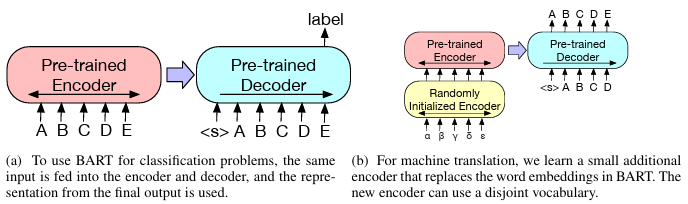

# BART

- 2019년 10월 Facebook에서 발표한 논문임
- Denosing Sequence-to-Sequence Pre-training for Natural Language Generation, Translation, and Comprehension

### 0. Abstract

- BART는 Seq2seq 구조를 기반으로 한 [Denosing Autoencoder](#denosing-autoencoder)임
    - Text에 임의의 Noise를 주어 변형시킨 후, 원본 Text로 복원하며 모델을 학습시킴
    - 표준 Transformer 기반 MNT(Neural Machine Translation) 구조를 사용함
    - 단순한 구조임에도 BERT와 GPT를 포함한 다양한 사전 학습 방식을 일반화함

- 원본 문장들의 순서를 무작위로 섞고([Sentence Permutation](#sentence-permutation)), [Span](#Span)이 하나의 Mask Token으로 치환되는([Text Infilling](#text-infilling)) 새로운 **<u>In-filling</u>** 방식을 사용할 때 가장 우수한 성능을 보였음

- BART는 Text 생성 작업을 위한 Fine-tuning에서 특히 효과적이었지만, 이해력이 요구되는 작업에서도 잘 작동함
    - [GLUE](#glue) 및 [SQuAD](#squad) Benchmark에서는 [RoBERTa](#roberta)와 유사한 학습 자원 하에서 비슷한 성능을 기록함
    - 추상적 대화, 질의응답, 요약 작업에서는 최고 성능(최대 6 ROUNGE 포인트 향상)을 달성함
    - 또한, 기계 번역을 위한 역번역([Back-translation](#back-translation)) 작업에서도 Target 언어에 대한 사전 학습만으로 1.1 [BLEU](#bleu) (Bilingual Evaluation Understudy) 향상함

---

### 1. Introduction

- Self-supervised 기법들은 NLP 분야에서 뛰어난 성과를 보여주었음
    - 가장 성공적인 기법은 무작위로 Masked Text를 복원하도록 학습하는 Denosing Autoencoder, 즉 Masked 언어 모델의 변형들임

- 최근 연구에서는 Masked Token의 분포, 예측 순서, 대체 가능한 문맥을 개선하는 성과를 달성함
    - 하지만 이 기법들은 특정 End Task(Span 예측, 생성 등)에만 집중하여 적용 가능성이 제한적임

- 본 논문에서는 양방향(Bidirectional)과 자기회귀(Auto-regressive) Transformer를 결합한 사전 학습 모델인 BART를 제안함

- BART는 다양한 End Task에 적용 가능한 Seq2seq 기반 Denosing Autoencoder임
    - 사전 학습은 Text를 임의의 Nosing 함수로 변형한 후, Seq2seq 모델이 원본 Text로 복구하도록 학습하는 방식임

- BART는 표준 Transformer 기반 NMT 구조를 사용함
    - 단순한 구조임에도 양방향 Encoder인 BERT와 단방향(좌→우) Decoder인 GPT를 포함하여 다양한 최신 사전 학습 방식들을 일반화함 (***Figure 1***)

**[Figure 1] BERT, GPT, BART 방식 비교**


```
(a) BERT는 임의 Token을 Masking 후 양방향으로 문서를 Encoding하고, 
    Masked Token을 독립적으로 예측하기 때문에 생성 작업에는 적합하지 않음
(b) GPT는 Token을 자기회귀적으로 예측하여 생성 작업에는 적합하지만, 
    좌측 문맥만 활용할 수 있어 양방향 상호작용을 학습할 수 없음
(c) BART는 Encoder 입력과 Decoder 출력이 일치할 필요가 없어 임의의 Noise 변환을 적용할 수 있음
    - 이때 문서는 일부 Span이 Masking 기호로 치환된 상태임
    - 변형된 문서(왼쪽)는 양방향 모델로 Encoding되고, 
      이후 원본 문서(오른쪽)로 자기회귀적으로 Decording하여 복원함
    - Fine-tuning 시에는 손상되지 않은 문서를 Encoder와 Decoder에 입력하며, 
      Decoder의 마지막 Hidden State에서 표현(Representation)을 추출해 사용함
```

- 이 방식의 주요 장점은 Noising의 유연성으로, 원본 Text 길이 변경을 포함해 다양한 변형이 가능함

- 다양한 Noising 기법을 평가한 결과, 원본 문장을 랜덤하게 섞은 후, 길이 0을 포함한 임의 길이의 Span을 하나의 Mask Token으로 대체하는 새로운 In-filling 방식을 사용하는 것이 가장 우수한 성능 보임
    - 이 기법은 모델이 전체 문장 길이에 대해 더 깊이 추론하고 입력보다 더 긴 변환을 하도록 강제하여, BERT의 원본 단어 Masking과 NSP(Next Sentence Prediction) 목표를 일반화함

- BART는 Text 생성 작업을 위해 Fine-tuning 되었을 때 특히 효과적이었으며, 이해력이 요구되는 작업에서도 잘 작동함
    - GLUE 및 SQuAD와 같은 Benchmark에서는 RoBERTa와 유사한 학습 자원 하에서 비슷한 성능을 기록하고, 추상적 대화, 질의응답, 요약 작업에서 최고 성능을 달성함
    - 예를 들어, XSum Benchmark에서는 이전 연구 대비 ROUNGE 점수 6점이 향상됨

- 또한, BART는 Fine-tuning에 대한 새로운 접근 방식을 제안함
    - BART 모델 위에 몇 개의 추가 Transformer Layer를 쌓는 새로운 기계 번역 방식을 제안함
    - 이 Layer들은 BART의 전파(Propagation)를 통해 외국어를 Noisy 영어로 번역하도록 학습되며, 이를 통해 BART를 사전 학습된 Target 언어 모델로 활용함

        > - BART는 사전 학습할 때 영어 문장을 손상시키고, 그 손상된 영어를 다시 원래 영어로 복원하는 방식으로 학습된 모델임
        > - 즉, Noisy 영어를 De-noised 영어로 복구를 잘하는 모델임
        > - 따라서 추가된 Transformer Layer로 외국어를 Noisy 영어로 변환해주면, BART는 Noisy 영어를 De-noised 영어로 자연스럽게 복원함 

    - 이 방식은 WMT Romanian-English Benchmark에서 기존 역번역 모델 대비 1.1 BLEU 만큼 성능을 향상시킴

- BART는 다양한 Task에 걸쳐 일관되게 강력한 성능을 보임 

---

### 2. Model

- BART는 손상된 문서를 원본 문서로 복원하는 Denoising Autoencoder임
    - 손상된 Text를 입력으로 받아, 양방향 Encoder와 단반향(좌→우) 자기회귀 Decoder를 갖춘 Seq2seq 모델로 구현됨
    - 사전 학습은 원본 문서에 대한 Negative Log Likelihood를 최소화하는 방식으로 진행됨

#### 2.1 Architecture

- BART는 표준 Seq2seq Transformer 구조를 사용함
    - 단, GPT와 동일하게 Activation 함수를 ReLU 대신 [GeLU](#gelu)로 변경하고, Parameter를 N(0, 0.02) 분포로 초기화함

- 기본 모델은 6개의 Encoder와 Decoder Layer를 사용하고, 대형 모델은 12개의 Layer를 사용함

- 이 구조는 BERT와 밀접한 관련이 있지만 다음과 같은 차이점이 있음
    - Decoder의 각 Layer는 Encoder의 마지막 Hidden Layer에 대해 추가적으로 Cross-attention을 수행함
    - BERT는 단어 예측 전에 Feed-forword Network를 추가로 사용하지만, BART는 사용하지 않음

- 전체적으로 BART는 동일 크기의 BERT 모델보다 약 10% 더 많은 Parameter를 가짐

#### 2.2 Pre-training BART

- BART는 문서를 손상시킨 후, Decoder 출력과 원본 문서 간의 cross-entropy loss를 최소화하는 방식으로 학습됨

- 특정 Noising 방식에만 최적화된 Denoising Autoencoder와 달리, BART는 다양한 유형의 손상된 문서를 학습에 활용할 수 있음
    - 원본 정보를 모두 잃은 경우, BART는 일반적인 언어 모델과 동일하게 동작함

- 잠재력이 있는 새로운 Noising 변형 기법을 실험함

##### Token Masking
- BERT와 동일하게, 무작위로 Token을 선택하여 `Mask`로 치환함

##### Token Delection
- 입력에서 무작위로 Token을 제거하고, 어떤 위치에서 입력이 누락되었는지 판단함

##### Text Infilling
- Poisson 분포 (λ = 3)를 기반으로 Span 길이를 Sampling하여 무작위로 Text Span을 선택하고, 각 Span을 하나의 `Mask` Token으로 교체함
- 길이가 0인 Span도 `Mask` Token으로 치환될 수 있음
- SpanBERT에서는 Geometric 분포를 통해 Sampling하고, 각 Span을 동일 길이의 `Mask` Token으로 교체하는 방식을 제안함
- Text Infilling은 모델이 하나의 Span으로 누락된 Token 수를 예측하도록 학습함

##### Sentence Permutation
- 문서를 마침표(Full Stop) 기준으로 문장을 나누고, 그 문장들을 무작위로 섞음

##### Document Rotation
- 문서에서 무작위로 하나의 Token을 선택하여 해당 Token으로 문서가 시작되도록 회전시키고, 모델이 문서의 시작을 식별하도록 학습시킴

**[Figure 2]** 입력 Text에 대한 여러 형태의 Noisy 변환은 조합하여 적용할 수 있음


---

### 3. Fine-tuning BART

- BART가 생성한 표현은 다양한 Downstream 작업에 활용될 수 있음

**[Figure 3] 분류 및 번역을 위한 BART의 Fine-tuning 구조**



```
(a) 분류 문제에서 BART는 Encoder와 Decoder에 동일한 입력을 주고, 마지막 출력의 표현을 사용함
(b) 기계 번역에서는 BART 앞에 Word Embedding을 위한 작은 Encoder를 추가로 학습시키며, 
    이 추가된 Encoder는 별도의 단어 집합(vocabulary)으로 사용할 수 있음
```

#### 3.1 Sequence Classification Tasks

- Sequence 분류 시에는 Encoder와 Decoder에 동일한 입력을 주고, Decoder의 마지막 Hidden State를 Multi-class 분류기에 입력함

- 이 기법은 BERT의 [CLS](#CLS) Token을 사용하는 방식과 유사하지만, BART는 Decoder 입력 끝에 특정 Token을 추가하여 해당 Token 표현이 전체 입력으로부터 생성된 Decoder의 Hidden State에 Attention 할 수 있도록 함 (***Figure 3a***)

    > - Decoder 입력 끝에 Token을 하나 더 붙여, 그 Token이 전체 입력 내용을 요약한 표현을 갖도록 만드는 구조임

#### 3.2 Token Classification Tasks

- Token 분류 시에는 SQuAD의 답변 Endpoint 분류와 유사하게, 전체 문서를 Encoder와 Decoder에 입력한 뒤, 각 단어의 표현이 포함된 Decoder의 상단 Hidden State를 활용해 분류를 수행함

#### 3.3 Sequence Generation Tasks

- BART는 자기회귀 Decoder를 갖추고 있어, 추상적인 질의응답과 요약과 같은 Sequence 생성 작업을 직접 수행할 수 있음
- 이 두 작업은 정보를 입력으로부터 복사해 활용하지만, Denoising 사전 학습 방식과 밀접하게 연관되어 작동함

    > - BART의 사전 학습 방식은 Noisy 데이터를 복원하는 학습임 (Denosing)
    > - 따라서 질의응답이나 요약처럼 입력 일부를 기반으로 출력을 생성하는 작업은 BART의 학습 구조 자체가 잘 맞아 떨어짐

- 이때 Encoder 입력은 입력 Sequence이며, Decoder는 출력을 자기회귀적으로 생성함

#### 3.4 Machine Translation

- BART는 영어로 번역하는 기계 번역 Decoder의 성능을 향상시킴
    - 기존 연구 Edunov(2019)에서는 사전 학습된 Encoder를 통합하여 성능을 높였지만, Decoder의 언어 모델은 이점이 제한적임
- Bitext(Source와 Target 언어가 1:1로 매핑된 문자쌍)로 학습된 Encoder Parameter Set을 새로 추가하여, BART(Encoder와 Decoder 모두)가 기계 번역을 위한 하나의 사전 학습된 Decoder로 사용 가능함 (***Figure 3b***)
    - 보다 정확히는, BART의 Embedding Layer를 무작위로 초기화된 새로운 Encoder로 교체함
    - 추가된 Encoder는 외국어 단어를 BART가 복원 가능한 형태의 입력(Noisy 영어)으로 바꾸어 주도록 학습함

- 추가된 Encoder는 두 단계로 학습하며, 역전파(Backpropagation)는 BART 출력에 대한 Cross-entory Loss임
    - 먼저 BART의 대부분 Parameter를 고정하고, 무작위로 초기화된 Encoder와 BART의 위치 Embedding, BART의 첫 Encoder Layer의 Self-attention 입력인 Projection Matrix를 업데이트함
    - 다음으로 작은 수의 Iteration으로 모델의 모든 Parameter를 학습함 (End-to-end 학습)

---

### 4. Comparing Pre-training Objectives

- BART는 이전 연구 보다 다양한 Noising 방식을 사전 학습에 활용할 수 있음

- 기본 모델(6-layer Encoder와 6-layer Decoder, 768개의 Hidden)을 사용하여 다양한 방식을 비교함
    - 5장에서 다룰 대규모 실험의 일부 작업을 기준으로 평가됨

#### 4.1 Comparision Objectives

- 그동안 다양한 사전 학습 방식(Objective)이 제안되었지만, 학습 데이터와 자원, 모델 구조, Fine-tuning 절차의 차이로 인해 모델 간의 성능을 공정하게 비교하기는 어려움

- 이에 본 연구에서는 최근에 제안된 판별 및 생성 작업을 위한 주요 사전 학습 방식을 재구현함
    - 공정한 비교를 위해 사전 학습 방식 외의 요소는 최대한 통제함
    - 다만, Learning Rate와 Layer 정규화 사용은 성능 향상을 위해 (각 방식에 맞게 별도로 조정하여) 미세하게 변경함

- 참고로, 구현된 방식은 다양한 서적과 Wikipedia 데이터로 100만 Step 학습된 BERT와 비교함
    > - BART 구조에 다양한 사전 학습 방식을 적용시켜 BERT와 비교함
    > - BART의 Denosing Autoencoder와 다른 사전 학습 방식을 비교함

##### Language Model
- GPT와 유사하게 단반향(좌→우) Transformer 언어 모델을 학습함
- 이 모델은 Cross-attention이 제거된 BART Decoder와 구조적으로 동일함

##### Permuted Language Model
- XLNet 기반으로, 전체 Token 중 1/6을 Sampling하여 무작위 순서(Permutation)에 따라 자기회귀적으로 Token을 생성함
- 다른 모델과의 일관성을 위해 XLNet의 Relative Positional Embedding이나 Segment 간 Attention은 구현하지는 않음

##### Masked Language Model
- BERT와 동일하게, 전체 Token 중 15%를 `MASK`로 치환하여 원래 Token을 독립적으로 예측하도록 모델을 학습시킴

##### Multitask Masked Language Model
- UniLM에서 제안된 방식으로, 다양한 Self-attention Mask와 함께 Masked 언어 모델을 학습시킴
- Self-attention Mask는 다음과 같은 비율로 무작위 선택됨
    - 1/6은 단방향(좌→우) Mask
    - 1/6은 단방향(우→좌) Mask
    - 1/3은 Unmasked(양방향)
    - 1/3은 Token Sequence의 앞 50%는 Unmasked(양방향), 나머지는 단반향(좌→우) Mask

##### Masked Seq-to-Seq

- MASS에서 영감을 받아, 전체 Token Sequence 중 50%를 차지하는 Span(연속된 Token)을 Masking하고 해당 Span을 예측하도록 Seq2seq 모델을 학습시킴

<br>

- Permuted, Masked, Multitask Masked 언어 모델은 Sequence 출력의 Likelihood를 효율적으로 계산하기 위해 [Two-stream Attention](#two-stream-attention)을 사용함
    > - 일반적인 자기회귀(Autogressive) 방식은 한 Token 씩 순차적으로 예측하므로 비효율적으로 계산됨
    > - Two-stream 구조는 전체 Target Sequence의 Likelihood를 동시에 계산할 수 있음

    - 이때 Decoder 출력에는 단어를 왼쪽에서 오른쪽으로 예측하도록 Diagonal Self-attention Mask를 사용함

- 두 종류의 작업을 실험함
    - (1) 원천 입력을 Encoder로, Target을 Decoder 출력으로 하는 표준 Seq2seq 문제를 처리하는 작업
    - (2) Decoder에 Target의 접두사로 원천을 추가하며 Sequence의 Target 부분만 Loss로 계산하는 작업
        > - Decoder 입력으로 [원천 + Target] Sequence가 입력되며, Loss는 Target 부분만 계산함

#### 4.2 Tasks

##### SQuAD

- Wikipedia에서 추출된 질의응답 데이터셋으로, 답변은 주어진 문서 내에서 Text Span을 추출함
- BART는 BERT와 유사하게 질문과 문맥을 Encoder 입력으로 사용하며, Decoder에도 이를 함께 입력함
    - 이 모델에는 답변의 시작 및 종료 Token 위치를 예측하는 Token-level 분류기가 포함되어 있음

##### MNLI

- 한 문장이 다른 문장을 수반하는지 예측하는 Bitext 분류 작업임
- Fine-tuning된 모델은 EOS Token을 포함하여 두 문장을 연결하고, BART의 Encoder와 Decoder 모두에 이들을 입력됨
- BERT와 달리 EOS Token의 표현은 문장 간 관계 분류에 사용함

##### ELI5

- 장문의 추상적 질의응답 데이터셋으로, 모델은 질문과 관련 문서를 조합하여 답변을 생성함

##### XSum

- 뉴스 요약 데이터셋이며, 매우 추상적으로 요약됨

##### ConvAI2

- 대화 응답 생성 작업으로, 문맥과 한 타인의 응답을 조합함

##### CNN/DM

- 뉴스 요약 데이터셋으로, 원문과 밀접하게 연관되어 요약됨

#### 4.3 Results

###### [Table 1] 사전 학습 방식 비교


```
- 모든 모델은 유사한 크기이며, 서적과 Wikipedia 데이터를 조합하여 100만 Step 학습됨
- 아래 두 블록의 항목은 동일한 코드 기반으로 동일한 데이터로 학습되었으며, 동일한 절차로 Fine-tuning 되었음
- 두번째 블록의 항목은 이전 연구에서 제안된 사전 학습 방식에 영감을 받았지만, 평가 목표에 초점을 맞추어 단순화됨
- 성능은 작업별로 상당한 차이를 보이지만, Text Infilling을 적용한 BART 모델이 가장 일관성있게 우수한 성능을 보여줌
```

**사전 학습 방식의 성능은 작업별로 상당히 상이함**
- 사전 학습 방식의 유효성은 Downstream 작업에 따라 크게 달라짐
- 예를 들어, 간단한 언어 모델은 ELI5에서는 가장 우수한 성능을 보였지만, SQuAD에서는 가장 낮은 성능을 기록함

**Token Masking은 핵심 요소임**
- 문서를 회전시키거나 문장 순서를 섞는 방식의 사전 학습은 성능이 매우 낮았음
- Token을 제거하거나 Masking하는 방식과 Self-attention Mask를 사용하는 방식이 성공적이었음
- 특히 생성 작업에서는 Token 제거 방식이 Masking 방식을 능가함

**단방향(좌→우) 사전 학습은 생성 성능을 향상시킴**
- Masked와 Permuted 언어 모델은 사전 학습 시 단방향(좌→우) 자기회귀 언어 모델 구조을 사용하지 않아, 생성 작업에서 성능이 낮았음

**양방향 Encoder는 SQuAD 작업에서 중요함**
- BERT(Devlin et al., 2019)에서 언급했듯이, 분류 결정에서 이후 문맥은 중요하기 때문에 단방향(좌→우) Decoder는 SQuAD 성능이 낮았음 
- 하지만 BART는 절반의 양방향 Layer로 BERT와 유사한 성능을 달성함
    > - BERT는 12-Layer Encoder(양방향) 구조임
    > - BART는 6-Layer Encoder(양방향)와 12-Layer Decoder(단방향) 구조임

**사전 학습 방식만으로 성능을 결정짓는 요소는 아님**
- Permuted 언어 모델은 XLNet(Yang et al., 2019) 보다 성능이 나빴음 
- 다만, Relative-position Embedding과 Segment-level Attention가 구현되지 않았기 때문일 수 있음

**순수 언어 모델은 ELI5에서 성능이 가장 우수함**
- ELI5는 이례적인 결과이며, 다른 모델이 BART를 능가하는 유일한 생성 작업임
- 순수 언어 모델이 가장 우수했으며, BART는 출력이 입력과의 의미적 연결이 약할 때 비효율적일 수 있음
    > - BART는 입력을 복원하거나, 입력 기반으로 출력을 구성하는 데 최적화되어 있음
    > - 따라서 입력에 구속받지 않고 자유롭게 생성해야 하는 경우 한계가 있을 수 있음
    > - ELI5는 질문이 짧고 답변이 장문이기 때문에 추상적으로 새로운 문장을 생성하는 능력이 필요함

**BART는 가장 일관성있는 우수한 성능을 달성함**
- Text-infilling 방식을 사용한 BART 모델은 ELI5을 제외한 모든 작업에서 잘 작동함

---

### 5. Large-scale Pre-training Experiments

- 최근 연구에서는 큰 batch size와 방대한 말뭉치(Corpus)를 사전 학습시켰을 때 downstream 성능이 극적으로 향상됨을 보여줌
- 이에 따라 BART 성능을 정확하게 평가하고, downstream 작업에 실질적으로 유용한 모델로 만들기 위해 RoBERTa와 동일한 규모로 BART를 학습시킴

#### 5.1 Experimental Setup

- BART는 12-layer encoder와 12-layer decoder, hidden size 1,024개로 구성된 대규모 모델을 학습함
- RoBERTa와 동일하게 batch size 8,000개, 총 50만 step으로 사전 학습을 수행함
- 문서는 GPT-2 tokenizer를 사용해 문서 단위로 쌍을 이루어 encoding됨
- 4장의 결과를 바탕으로 <u>**text infilling**</u>과 <u>**sentence permutation**</u> 방식의 조합을 사용함
    - 각 문서의 약 30% token을 masking하고, 모든 문장을 무작위로 섞음
    - sentence permutation 방식이 CNN/DM 요약 작업에서만 추가 이점을 보였지만, 이 방식으로 대규모 사전 학습 모델이 더 잘 학습될 수 있다고 가정함
- 모델이 데이터에 더 잘 적합되도록 학습 후반 10% step은 dropout을 사용하지 않음
- 사전 학습 데이터는 RoBERTa와 동일하게 뉴스, 서적, 스토리, 웹 등 총 160GB 규모를 사용함

#### 5.2 Discriminative Tasks

###### [Table 2] SQuAD 및 GLUE 작업에 대한 대규모 모델 성능 비교


```
BART는 판별 작업에서 단방향 decoder layer 성능이 저하되지 않았으며, 
RoBERTa와 XLNet과 비슷한 성능임
```

- 동일한 자원으로 사전 학습된 RoBERTa가 가장 직접적인 비교 기준이지만, 사전 학습 방식에는 차이가 있음
- 전반적으로 BART는 유사한 수준의 성능을 보였으며, 대부분의 작업에서 모델 간 성능 차이는 미미함
    - 이는 생성 작업을 위한 BART가 분류(판별) 성능도 경쟁력 있음을 시사함

#### 5.3 Generation Tasks

- BART는 입력 text로부터 출력 text를 생성하는 표준 seq2seq 모델로 fine-tuning 되었음
- Fine-tuning 시에는 label smoothing이 적용된 cross-entropy loss를 사용하였으며, smoothing parameter는 0.1로 설정함
- Text 생성 시에는 beam size를 5로 설정하고, beam search 과정에서 중복된 trigram을 제거함
    > - 매 token 생성 마다 확률이 높은 5개의 문장을 후보로 두고, 마지막에 가장 확률이 높은 문장을 고름
    > - 문장의 질을 높이기 위해 3개 연속 반복되는 token이 포함된 문장은 제거함


- 평가 데이터셋은 최소/최대 길이 및 길이 보정 계수(Length Penalty)를 적용함
    > - 긴 문장은 token을 더 많이 생성하므로 전체 확률이 작아져 모델이 짧은 문장을 더 선호할 수 있음
    > - 이런 상황을 보정해주기 위해 text 길이 관련 parameter를 설정함


---

# Dictionaly

### Denosing Autoencoder

- 일반 Autoencoder는 원본 데이터를 그대로 입력해서 다시 복원하는 방식임
- Denoising Autoencoder는 원본에 일부러 노이즈를 섞은 데이터를 입력으로 사용함
- 출력은 노이즈 없는 원본 데이터를 목표로 학습함
- 즉, DAE는 입력이 손상되더라도 원래 모습을 잘 복원할 수 있도록 학습되는 구조임
- 따라서 일반 Autoencoder보다 더 견고하게 중요한 특징만 잘 추출하는 데 유리함

### Span

- 연속된 단어나 문장의 조각을 의미함
- 단어 하나가 아니라 여러 단어가 묶여 있는 덩어리를 가리킴
- 단어 단위가 아니라 구(phrase)나 문장 조각 단위로 다뤄질 수 있음

### RoBERTa

- RoBERTa는 페이스북에서 개발한 BERT 개선 버전 모델임
- BERT랑 구조는 같지만 학습 데이터를 훨씬 많이 사용하고, 마스킹 방식도 더 정교하게 조정함
- NSP(Next Sentence Prediction)을 제거하여 성능을 높였음 <br>(NSP Task가 실제로 언어 이해 능력 향상에는 큰 도움이 안됨을 실험으로 확인함)

### GLUE

- GLUE는 다양한 NLP 과제를 모아놓은 benchmark 테스트임
- 문장 추론, 유사도, 감정 분류 등 총 9개의 Task로 구성되어 있음
- 모델이 얼마나 언어를 잘 이해하는지를 평가하는 데 쓰임
- 많은 모델들이 이 점수를 기준으로 성능을 비교함

### SQuAD

- SQuAD는 QA Task를 위한 데이터셋임
- 주어진 지문에서 사용자가 묻는 질문에 답을 찾아야 하는 형식임
- 정답은 보통 지문 안에 존재하는 문장 일부임
- Stanford에서 만든 데이터셋으로 Stanford Question Answering Dataset의 약자임

### Back-translation

- Back-translation은 기계번역에서 자주 쓰이는 데이터 증강 기법임
- Target language 문장을 source langauge로 역번역하여 새로운 훈련 데이터를 생성함

### BLEU

- 기계번역 품질 평가 지표 중 가장 널리 쓰이는 점수임
- 0~100 사이의 점수로, 높을수록 사람 번역과 유사하다는 의미임
- 모델이 생성한 번역 결과와 정답 간의 n-gram 단위 일치도를 평가함

### GeLU

- Gaussian Error Linear Units
- $ GeLU(x) = xP(X \leq x) =  x \Phi(x) = x \cdot \frac{1}{2}[1+erf(\frac{x}{\sqrt{2}})]$
    - $ \Phi(x) $ : CDF (Standard Gaussian Cumulative Distribution Function)
    - CDF를 사용하여 입력값 크기에 따라 확률적으로 가중치를 부여함
    - $ erf(x) = \frac{2}{\sqrt{\pi}} \int_{0}^{x} e^{-t^2} \, dt $ : Error Function
- $ GeLU(x) \approx 0.5x \left( 1 + \tanh\left( \sqrt{\frac{2}{\pi}} \left( x + 0.044715x^3 \right) \right) \right) $
    - 계산 비용이 비싸기 때문에 $ tanh $ 기반 근사식을 사용하기도 함

### CLS

### Two-stream Attention

- Two-stream Attention은 Permutation 기반 언어 모델에서 예측 위치의 불확실성을 해결하기 위해 도입됨
- 전체 Attention 구조를 Query Stream과 Content Stream으로 분리하여 구성함
    - Query Stream은 Target 위치와 해당 위치 이전 Token의 정보만 활용하여 학습됨 (Target Token 사용 안함)
    - Content Stream은 Target Token까지 포함한 Token 정보를 활용하여 학습됨 (Target Token 사용)
- Attention 연산은 Query Stream에서 생성된 Query와 Content Stream에서 생성된 Key/Value를 활용하여 수행됨
- 이 구조는 정보 누설(Target Leakage)을 방지하며, 병렬적인 likelihood 계산을 가능하게 함

---

# Reference

- [논문 원본](https://arxiv.org/pdf/1910.13461)
- [ACL 발표 논문 (2020)](https://aclanthology.org/2020.acl-main.703/)
- [논문 요약](https://velog.io/@tobigs-nlp/BART-DeNoising-Sequence-to-Sequence-Pre-training-for-Natural-Language-Generation-Translation-and-Comprehension)
- [논문 번역](https://velog.io/@dutch-tulip/BART)
- [GeLU](https://jik9210.tistory.com/14)
- [XLNet, Two-stream Attention](https://velog.io/@zhenxi_23/%EB%85%BC%EB%AC%B8%EB%A6%AC%EB%B7%B0-XLNet)

---

# Original Text

### 0. Abstract

```
We present BART, a deNoising autoEncoder for pretraining sequence-to-sequence models.

BART is trained by (1) corrupting Text with an arbitrary Noising function, 
and (2) learning a model to reconstruct the original Text.

It uses a standard Tranformer-based neural machine translation architecture which, 
despite its simplicity, can be seen as generalizing BERT (due to the bidirectional Encoder), 
GPT (with the left-to-right Decoder), and many other more recent pretraining schemes.

We evaluate a number of Noising approaches, 
finding the best performance 
by both randomly shuffling the order of the original sentences and using a novel in-filling scheme, 
where Spans of Text are replaced with a single Mask Token.

BART is particularly effective when fine tuned for Text generation
but also works well for comprehension Tasks.

It matches the performance of RoBERTa with comparable training resources on GLUE and SQuAD, 
achieves new stateof-the-art results on a range of 
abstractive dialogue, question answering, and summarization Tasks, with gains of up to 6 ROUGE.

BART also provides a 1.1 BLEU increase over a back-translation system for machine translation, 
with only target language pretraining.

We also report ablation experiments that replicate other pretraining schemes within the BART framework, 
to better measure which factors most influence end-Task performance.
```

### 1. Introduction

```
Self-supervised methods have achieved remarkable success in a wide range of NLP Tasks
(Mikolov et al., 2013; Peters et al., 2018; Devlin et al., 2019; Joshi et al., 2019; Yang et al., 2019; Liu et al., 2019).

The most successful approaches have been variants of Masked language models, 
which are deNoising autoEncoders that are trained to reconstruct Text 
where a random subset of the words has been Masked out.

Recent work has shown gains by improving the distribution of Masked Tokens (Joshi et al., 2019), 
the order in which Masked Tokens are predicted (Yang et al., 2019), 
and the available conText for replacing Masked Tokens (Dong et al., 2019).

However, these methods typically focus on particular types of end Tasks (e.g. Span prediction, generation, etc.), 
limiting their applicability.

In this paper, we present BART, 
which pre-trains a model combining Bidirectional and Auto-Regressive Transformers.

BART is a deNoising autoEncoder built with a sequence-to-sequence model that is applicable
to a very wide range of end Tasks.

Pretraining has two stages (1) Text is corrupted with an arbitrary Noising function,
and (2) a sequence-to-sequence model is learned to reconstruct the original Text. 

BART uses a standard Tranformer-based neural machine translation architecture which, 
despite its simplicity, can be seen as generalizing BERT (due to the bidirectional Encoder),
GPT (with the left-to-right Decoder), and many other more recent pretraining schemes (see Figure 1).

Figure 1: A schematic comparison of BART with BERT (Devlin et al., 2019) and GPT (Radford et al., 2018).

(a) BERT: Random Tokens are replaced with Masks, and the document is encoded bidirectionally.
Missing Tokens are predicted independently, so BERT cannot easily be used for generation.

(b) GPT: Tokens are predicted auto-regressively, meaning GPT can be used for generation.
However words can only condition on leftward conText, so it cannot learn bidirectional interactions.

(c) BART: Inputs to the Encoder need not be aligned with Decoder outputs, allowing arbitary Noise transformations.
Here, a document has been corrupted by replacing Spans of Text with Mask symbols.
The corrupted document (left) is encoded with a bidirectional model,
and then the likelihood of the original document (right) is calculated with an autoregressive Decoder.
For Fine-tuning, an uncorrupted document is input to both the Encoder and Decoder,
and we use representations from the final hidden state of the Decoder.

A key advantage of this setup is the Noising flexibility;
arbitrary transformations can be applied to the original Text, including changing its length.

We evaluate a number of Noising approaches, finding the best performance 
by both randomly shuffling the order of the original sentences and using a novel in-filling scheme,
where arbitrary length Spans of Text (including zero length) are replaced with a single Mask Token.

This approach generalizes the original word Masking and next sentence prediction objectives in BERT 
by forcing the model to reason more about overall sentence length and make longer range transformations to the input.

BART is particularly effective when fine tuned for Text generation but also works well for comprehension Tasks. 

It matches the performance of RoBERTa (Liu et al., 2019) 
with comparable training resources on GLUE (Wang et al., 2018) and SQuAD (Rajpurkar et al., 2016),
and achieves new state-of-the-art results on a range of abstractive dialogue, question answering, and summarization Tasks. 

For example, it improves performance by 6 ROUGE over previous work on XSum (Narayan et al., 2018).

BART also opens up new ways of thinking about fine tuning.

We present a new scheme for machine translation
where a BART model is stacked above a few additional transformer layers.

These layers are trained to essentially translate the foreign language to Noised English,
by propagation through BART, thereby using BART as a pre-trained target-side language model.

This approach improves performance over a strong back-translation MT baseline
by 1.1 BLEU on the WMT Romanian-English benchmark.

To better understand these effects,
we also report an ablation analysis that replicates other recently proposed training objectives. 

This study allows us to carefully control for a number of factors, 
including data and optimization parameters, which have been shown
to be as important for overall performance as the selection of training objectives (Liu et al., 2019). 

We find that BART exhibits the most consistently strong performance across the full range of Tasks we consider.
```

### 2. Model

```
BART is a deNoising autoEncoder that maps a corrupted document to the original document it was derived from.

It is implemented as a sequence-to-sequence model with a bidirectional Encoder 
over corrupted Text and a left-to-right autoregressive Decoder.

For pre-training, we optimize the negative log likelihood of the original document.
```

##### 2.1 Architecture

```
BART uses the standard sequence-to-sequence Transformer architecture from (Vaswani et al., 2017), 
except, following GPT, that we modify ReLU activation functions to GeLUs (Hendrycks & Gimpel, 2016)
and initialise parameters from N (0, 0.02).

For our base model, we use 6 layers in the Encoder and Decoder, and for our large model we use 12 layers in each. 

The architecture is closely related to that used in BERT, with the following differences: 
(1) each layer of the Decoder additionally performs cross-attention over the final hidden layer of the Encoder (as in the transformer sequence-to-sequence model); 
and (2) BERT uses an additional feed-forward network before wordprediction, which BART does not. 

In total, BART contains roughly 10% more parameters than the equivalently sized BERT model.
```

##### 2.2 Pre-training BART

```
BART is trained by corrupting documents and then 
optimizing a reconstruction loss—the cross-entropy between the Decoder’s output and the original document.

Unlike existing deNoising autoEncoders, which are tailored to specific Noising schemes, 
BART allows us to apply any type of document corruption. 

In the extreme case, where all information about the source is lost,
BART is equivalent to a language model.

We experiment with several previously proposed and novel transformations, 
but we believe there is a significant potential for development of other new alternatives. 

The transformations we used are summarized below, and examples are shown in Figure 2.

Token Masking
Following BERT (Devlin et al., 2019), random Tokens are sampled and replaced with [Mask] elements.

Token Deletion 
Random Tokens are deleted from the input.
In contrast to Token Masking, the model must decide which positions are missing inputs.

Text Infilling 
A number of Text Spans are sampled, with Span lengths drawn from a Poisson distribution (λ = 3).
Each Span is replaced with a single [Mask] Token. 
0-length Spans correspond to the insertion of [Mask] Tokens. 
Text infilling is inspired by SpanBERT (Joshi et al., 2019), 
but SpanBERT samples Span lengths from a different (clamped geometric) distribution, 
and replaces each Span with a sequence of [Mask] Tokens of exactly the same length. 
Text infilling teaches the model to predict how many Tokens are missing from a Span.

Sentence Permutation 
A document is divided into sentences based on full stops, 
and these sentences are shuffled in a random order.

Document Rotation 
A Token is chosen uniformly at random, 
and the document is rotated so that it begins with that Token. 
This Task trains the model to identify the start of the document.

Figure 2: Transformations for Noising the input that we experiment with.
These transformations can be composed.
```

### 3. Fine-tuning BART

```
The representations produced by BART can be used in several ways for downstream applications.

Figure 3: Fine tuning BART for classification and translation.

(a) To use BART for classification problems, the same input is fed into the Encoder and Decoder, 
and the representation from the final output is used.

(b) For machine translation, we learn a small additional Encoder that replaces the word embeddings in BART. 
The new Encoder can use a disjoint vocabulary.
```

##### 3.1 Sequence Classification Tasks

```
For sequence classification Tasks, the same input is fed into the Encoder and Decoder, 
and the final hidden state of the final Decoder Token is fed into new multi-class linear classifier. 

This approach is related to the CLS Token in BERT;
however we add the additional Token to the end 
so that representation for the Token in the Decoder can attend to Decoder states from the complete input (Figure 3a).
```

##### 3.2 Token Classification Tasks

```
For Token classification Tasks, such as answer endpoint classification for SQuAD, 
we feed the complete document into the Encoder and Decoder, 
and use the top hidden state of the Decoder as a representation for each word. 
This representation is used to classify the Token.
```

##### 3.3 Sequence Generation Tasks

```
Because BART has an autoregressive Decoder, it can be directly fine tuned for sequence generation Tasks
such as abstractive question answering and summarization.

In both of these Tasks, information is copied from the input but manipulated, 
which is closely related to the deNoising pre-training objective. 

Here, the Encoder input is the input sequence, and the Decoder generates outputs autoregressively.
```

##### 3.4 Machine Translation

```
We also explore using BART to improve machine translation Decoders for translating into English. 

Previous work Edunov et al. (2019) has shown that models can be improved by incorporating pre-trained Encoders,
but gains from using pre-trained language models in Decoders have been limited.

We show that it is possible to use the entire BART model (both Encoder and Decoder) 
as a single pretrained Decoder for machine translation, 
by adding a new set of Encoder parameters that are learned from biText (see Figure 3b).

More precisely, we replace BART’s Encoder embedding layer with a new randomly initialized Encoder.

The model is trained end-to-end, 
which trains the new Encoder to map foreign words into an input that BART can de-Noise to English. 

The new Encoder can use a separate vocabulary from the original BART model.

We train the source Encoder in two steps,
in both cases backpropagating the cross-entropy loss from the output of the BART model. 

In the first step, we freeze most of BART parameters and only update the randomly initialized source Encoder, the BART positional embeddings, 
and the self-attention input projection matrix of BART’s Encoder first layer.

In the second step, we train all model parameters for a small number of iterations.
```

### 4. Comparing Pre-training Objectives

```
BART supports a much wider range of noising schemes during pre-training than previous work. 

We compare a range of options using base-size models (6 encoder and 6 decoder layers, with a hidden size of 768), 
evaluated on a representative subset of the tasks we will consider for the full large scale experiments in §5.
```

##### 4.1 Comparision Objectives

```
While many pre-training objectives have been proposed, 
fair comparisons between these have been difficult to perform, 
at least in part due to differences in training data, training resources, architectural differences between models, and fine-tuning procedures. 

We re-implement strong pre-training approaches recently proposed for discriminative and generation tasks. 

We aim, as much as possible, to control for differences unrelated to the pre-training objective. 

However, we do make minor changes to the learning rate and usage of layer normalisation 
in order to improve performance (tuning these separately for each objective). 

For reference, we compare our implementations with published numbers from BERT, 
which was also trained for 1M steps on a combination of books and Wikipedia data.

We compare the following approaches:

Language Model
Similarly to GPT (Radford et al., 2018), we train a left-to-right Transformer language model. 
This model is equivalent to the BART decoder, without cross-attention.

Permuted Language Model
Based on XLNet (Yang et al., 2019), we sample 1/6 of the tokens, and generate them in a random order autoregressively. 
For consistency with other models, we do not implement the relative positional embeddings or attention across segments from XLNet.

Masked Language Model
Following BERT (Devlin et al., 2019), we replace 15% of tokens with [MASK] symbols, and train the model to independently predict the original tokens.

Multitask Masked Language Model
As in UniLM (Dong et al., 2019), we train a Masked Language Model with additional self-attention masks. 
Self attention masks are chosen randomly in with the follow proportions: 
1/6 left-to-right, 1/6 right-to-left, 1/3 unmasked, and 1/3 with the first 50% of tokens unmasked and a left-to-right mask for the remainder.

Masked Seq-to-Seq
Inspired by MASS (Song et al., 2019), we mask a span containing 50% of tokens,
and train a sequence to sequence model to predict the masked tokens.

For the Permuted LM, Masked LM and Multitask Masked LM, we use two-stream attention (Yang et al., 2019) 
to efficiently compute likelihoods of the output part of the sequence (using a diagonal self-attention mask on the output to predict words left-to-right).

We experiment with (1) treating the task as a standard sequence-to-sequence problem, 
where the source input to the encoder and the target is the decoder output, or 
(2) adding the source as prefix to the target in the decoder, with a loss only on the target part of the sequence. 

We find the former works better for BART models, and the latter for other models.

To most directly compare our models on their ability to model their fine-tuning objective (the log likelihood of the human text), 
we report perplexity in Table 1.
```

#### 4.2 Tasks

```
SQuAD (Rajpurkar et al., 2016)
a an extractive question answering task on Wikipedia paragraphs. 
Answers are text spans extracted from a given document context.
Similar to BERT (Devlin et al., 2019), 
we use concatenated question and context as input to the encoder of BART, and additionally pass them to the decoder. 
The model includes classifiers to predict the start and end indices of each token.

MNLI (Williams et al., 2017), 
a bitext classification task to predict whether one sentence entails another.
The fine-tuned model concatenates the two sentences with appended an EOS token, 
and passes them to both the BART encoder and decoder. 
In contrast to BERT,
the representation of the EOS token is used to classify the sentences relations.

ELI5 (Fan et al., 2019), 
a long-form abstractive question answering dataset. 
Models generate answers conditioned on the concatenation of a question and supporting documents.

XSum (Narayan et al., 2018), 
a news summarization dataset with highly abstractive summaries.

ConvAI2 (Dinan et al., 2019), 
a dialogue response generation task, conditioned on context and a persona.

CNN/DM (Hermann et al., 2015), 
a news summarization dataset. 
Summaries here are typically closely related to source sentences.
```

#### 4.3 Results

```
Table 1: Comparison of pre-training objectives.
All models are of comparable size and are trained for 1M steps on a combination of books and Wikipedia data. 
Entries in the bottom two blocks are trained on identical data using the same code-base, and fine-tuned with the same procedures. 
Entries in the second block are inspired by pre-training objectives proposed in previous work, but have been simplified to focus on evaluation objectives (see §4.1). 
Performance varies considerably across tasks, but the BART models with text infilling demonstrate the most consistently strong performance.

Results are shown in Table 1. 

Several trends are clear:

Performance of pre-training methods varies significantly across tasks 
The effectiveness of pre-training methods is highly dependent on the task. 
For example, a simple language model achieves the best ELI5 performance, but the worst SQUAD results.

Token masking is crucial 
Pre-training objectives based on rotating documents or permuting sentences perform poorly in isolation. 
The successful methods either use token deletion or masking, or self-attention masks. 
Deletion appears to outperform masking on generation tasks.

Left-to-right pre-training improves generation
The Masked Language Model and the Permuted Language Model perform less well than others on
generation, 
and are the only models we consider that do not include left-to-right auto-regressive language
modelling during pre-training.

Bidirectional encoders are crucial for SQuAD 
As noted in previous work (Devlin et al., 2019), just left-to-right decoder performs poorly on SQuAD, 
because future context is crucial in classification decisions. 
However, BART achieves similar performance with only half the number of bidirectional layers.

The pre-training objective is not the only important factor 
Our Permuted Language Model performs less well than XLNet (Yang et al., 2019). 
Some of this difference is likely due to not including other architectural improvements, 
such as relative-position embeddings or segment-level recurrence.

Pure language models perform best on ELI5 
The ELI5 dataset is an outlier, with much higher perplexities than other tasks, 
and is the only generation task where other models outperform BART. 
A pure language model performs best, suggesting that BART is less effective when the output is only loosely constrained by the input.

BART achieves the most consistently strong performance. 
With the exception of ELI5, BART models using text-infilling perform well on all tasks.
```

### 5. Large-scale Pre-training Experiments

```
Recent work has shown that downstream performance can dramatically improve 
when pre-training is scaled to large batch sizes (Yang et al., 2019; Liu et al., 2019) and corpora. 

To test how well BART performs in this regime, and to create a useful model for downstream tasks, 
we trained BART using the same scale as the RoBERTa model.
```

#### 5.1 Experimental Setup

```
We pre-train a large model with 12 layers in each of the encoder and decoder,  and a hidden size of 1024. 

Following RoBERTa (Liu et al., 2019), we use a batch size of 8000, and train the model for 500000 steps. 

Documents are tokenized with the same byte-pair encoding as GPT-2 (Radford et al., 2019). 

Based on the results in Section §4, we use a combination of text infilling and
sentence permutation. 

We mask 30% of tokens in each document, and permute all sentences. 

Although sentence permutation only shows significant additive gains on the CNN/DM summarization dataset, 
we hypothesised that larger pre-trained models may be better able to learn from this task. 

To help the model better fit the data, we disabled dropout for the final 10% of training
steps. 

We use the same pre-training data as Liu et al. (2019), consisting of 160Gb of news, books, stories, and web text.
```

#### 5.2 Discriminative Tasks

```
Table 2: Results for large models on SQuAD and GLUE tasks. 
BART performs comparably to RoBERTa and XLNet, suggesting that BART’s uni-directional decoder layers do not reduce performance on discriminative tasks.

Table 2 compares the performance of BART with several recent approaches on the well-studied SQuAD and GLUE tasks (Warstadt et al., 2018; Socher et al., 2013; Dolan & Brockett, 2005; Agirre et al., 2007; Williams et al., 2018; Dagan et al., 2006; Levesque et al., 2011).

The most directly comparable baseline is RoBERTa, which was pre-trained with the same resources, but a different objective. 

Overall, BART performs similarly, with only small differences between the models on most tasks. 

suggesting that BART’s improvements on generation tasks do not come at the expense of classification performance.
```

#### 5.3 Generation Tasks

```
We also experiment with several text generation tasks.

BART is fine-tuned as a standard sequence-to-sequence model from the input to the output text. 

During finetuning we use a label smoothed cross entropy loss (Pereyra et al., 2017), with the smoothing parameter set to 0.1. 

During generation, we set beam size as 5, remove duplicated trigrams in beam search, 
and tuned the model with min-len, max-len, length penalty on the validation set (Fan et al., 2017).
```