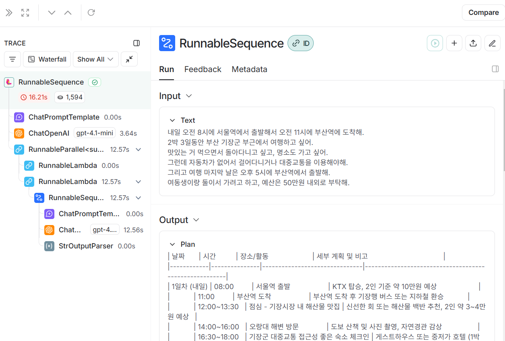

# LangSmith

- LangChain 팀이 개발한 프롬프트 및 LLM 앱 디버깅/실험 플랫폼임
- LangChain 기반 앱의 체인, 에이전트, 프롬프트 실행 과정을 시각화할 수 있음
- Prompt 버전 관리, 실험 로그 기록, 품질 평가 템플릿 설정 기능을 제공함
- 평가자 함수(custom evaluator)를 통한 정량적 평가가 가능함
- LangChain 외 타 프레임워크에서도 API 연동하여 사용할 수 있음
- 사용자의 응답 로그를 기반으로 개선 포인트를 도출할 수 있음
- UI에서 각 실행 단계를 상세히 확인할 수 있어 디버깅이 쉬움
- 프롬프트 설계와 품질 개선에 중점을 둔 운영 도구임

**`.env` 파일에 환경 변수 설정하기**

```.env
LANGSMITH_TRACING=true
LANGSMITH_API_KEY="lsv2_..."
LANGSMITH_PROJECT="{project_name}"
```

**Pricing**

| 플랜 | 가격 | 포함 사용자 | 월간 트레이스 | 주요 기능 요약 |
|---|---|---|---|---|
| Developer | 무료 | 1명 | 5,000건 | 디버깅, 데이터셋 수집, 평가/테스트, 프롬프트 관리, 모니터링 등 기본 기능 제공 |
| Plus | $39/월/사용자 | 최대 10명 | 10,000건 | Developer 기능 포함 + 팀 기능, 이메일 지원 |
| Enterprise | 맞춤형 (견적 요청) | 제한 없음 | 맞춤형 | Plus 기능 포함 + SSO, SLA, 온프레미스 배포, 전담 지원, 아키텍처 가이드 등 |


**LangSmith UI**





# Langfuse

- [GitHub](https://github.com/langfuse/langfuse)
- LLM 애플리케이션의 추적, 로깅, 분석을 위한 오픈소스 LLMOps 도구임
- Prompt, 응답, 토큰 사용량, 에러, 사용자 피드백 등 다양한 요소를 실시간으로 추적 가능함
- LangChain, LlamaIndex, OpenAI SDK 등 주요 프레임워크와 연동이 쉬움
- 대시보드를 통해 요청 흐름을 시각화하고, 디버깅 및 성능 개선에 용이함
- 자체 평가 지표 설정 및 A/B 테스트도 지원함
- 로그를 수동으로 분석하지 않고도 체계적으로 관리할 수 있음
- SaaS 형태와 Self-hosting 모두 가능함
- Prompt 관리보다는 전반적인 호출 추적 및 품질 모니터링에 초점이 맞춰져 있음
- 프론트엔드 구성은 없음, 백엔드 중심 도구임

# LlamaIndex

- [GitHub](https://github.com/run-llama/llama_index)
- LlamaIndex는 비정형 데이터를 LLM과 연결해주는 데이터 연결 프레임워크임
- 외부 문서(PDF, Notion, 웹 등)를 LLM이 이해할 수 있는 형태로 가공하고 인덱싱함
- Retriever, Query Engine, Storage 등 모듈로 구성되어 있음
- 문서를 청크 단위로 나눈 뒤 벡터화하여 검색 효율성을 높임
- RAG(Retrieval-Augmented Generation) 구조를 쉽게 구현할 수 있음
- 다양한 벡터 스토어(FAISS, Chroma 등) 및 LLM 프레임워크(LangChain, OpenAI 등)와 호환됨
- 자체 Query Pipeline으로 프롬프트 구성 및 응답 제어가 가능함
- 문서 기반 Q&A, 요약, 분류, 검색 등 다양한 태스크에 활용됨
- 내부 문서나 사내 지식 검색용 챗봇 등에 자주 사용됨
- 빠른 프로토타이핑과 맞춤형 LLM 어플리케이션 구축에 적합함

# Langfuse

[공식 문서](https://langfuse.com/docs/sdk/python/decorators)
[Docker Compose](https://langfuse.com/self-hosting/docker-compose)

**`.env` 파일에 환경 변수 설정하기**

```.env
LANGFUSE_SECRET_KEY="sk-..."
LANGFUSE_PUBLIC_KEY="pk-..."
LANGFUSE_HOST="https://cloud.langfuse.com"
```